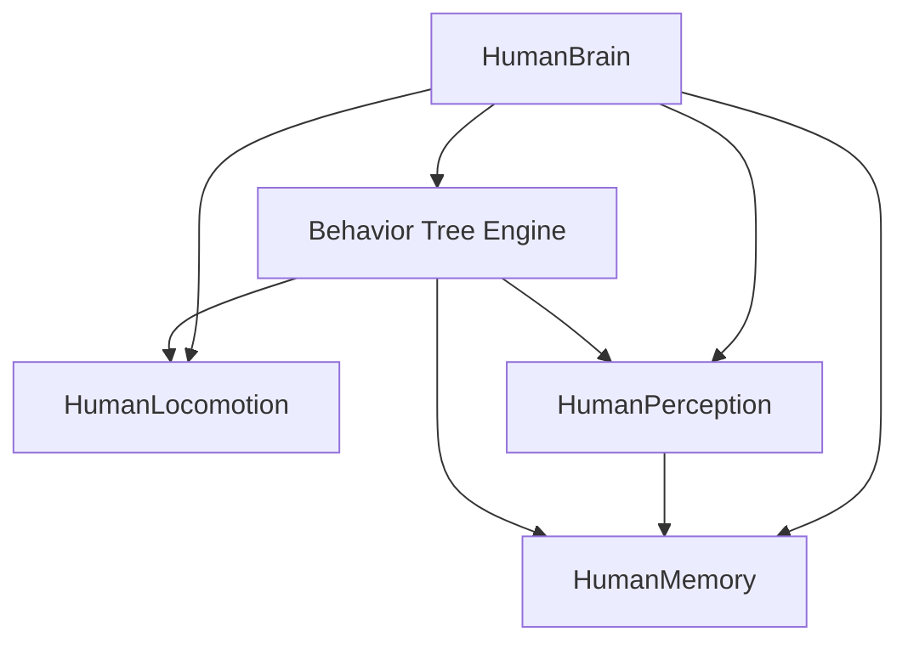

# Life Engine 3D

**Life Engine 3D** is an advanced 3D simulation of virtual humans powered by a custom behavior tree AI system in Unity. Agents interact with a dynamic environment to satisfy metabolic needs, seek thermal comfort, gather resources, craft tools, and build structures.

---

## 🛠️ Core Systems Architecture

### 1. 🧠 Human Brain (Orchestration & Drives)
The [`HumanBrain.cs`](file:///c:/UnityProjects/LifeEngine/Assets/Scripts/Humans/HumanBrain.cs) component acts as the central coordinator for simulated human agents. It manages metabolic variables, evaluates local environment factors, and updates agent states.
*   **Metabolic Drives**:
    *   **Adenosine (Sleep)**: Accumulates at a rate of `5.625` nM per in-game hour while awake, and clears at `11.25` nM per hour while sleeping. When high, agents are driven to seek shelter and sleep.
    *   **Ghrelin (Hunger)**: Accumulates at `140` pg/mL per hour, triggering food-seeking behaviors when passing the hunger threshold of `1200`.
*   **Thermal Comfort & Hysteresis**:
    *   Perceived temperature ranges between comfort bounds (default `18°C` to `26°C`).
    *   **Shade Detection**: When in daylight, a 5-point raycast silhouette check (Head, Center, Left/Right Shoulders, Feet) is projected towards the sun direction. If all 5 points are blocked by walls or tall trees, the agent is considered in shade, dropping perceived temperature by `10°C`.
    *   **Hysteresis Filtering**: Ambient temperature changes are interpolated smoothly (`Mathf.MoveTowards`) with a `2°C` buffer zone to prevent rapid, unstable state transitions.

### 2. 🏃 Human Locomotion & Physics Steering
The [`HumanLocomotion.cs`](file:///c:/UnityProjects/LifeEngine/Assets/Scripts/Humans/HumanLocomotion.cs) component features an industry-standard navigation system decoupled from Unity's default agent movement to handle simulations at high speed multipliers (up to 8x).
*   **Decoupled NavMeshAgent**: `updatePosition` and `updateRotation` are disabled. The `NavMeshAgent` is used purely as an invisible path calculator.
*   **Corridor Flaring**: Uses `NavMesh.FindClosestEdge` to push steering targets `0.25m` away from walls if agents get within `0.45m` of edges, preventing clipping.
*   **Predictive Wall Swerve**: Utilizes left/right bumper rays (angled at `35°` out to `0.65m`) to detect obstacles and steer away dynamically.
*   **Local Repulsion**: Nearby agents are detected using `Physics.OverlapSphereNonAlloc` and exert horizontal repulsion forces to prevent overlapping.
*   **Glide Stabilization**: Blends velocity profiles (30% new, 70% old) acting as a low-pass filter to eliminate high-frequency physics jitter.
*   **Hard Position Clamping**: Clamps the Rigidbody position to the nearest NavMesh position via `NavMesh.SamplePosition` if drift occurs.
*   **Progress-Based Stuck Detection & Rescue Nudges**: Checks progress every `0.4s`. If distance to target hasn't decreased by `0.05m` and physical velocity is `< 0.2m/s`, it initiates a **Rescue Nudge** (micro-teleport perpendicular to current direction + path recalculation) to break solver locks.

### 3. 👁️ Perception & Short-Term Memory
Simulated humans scan and remember their environment using specialized sensory components.
*   **Perception ([`HumanPerception.cs`](file:///c:/UnityProjects/LifeEngine/Assets/Scripts/Humans/HumanPerception.cs))**:
    *   **Sights & Angle**: Scans a radius of `15m` across a `200°` Field of View.
    *   **LOS Obstruction Raycasting**: Performs raycasts from eye-level (`1.5m`) using dynamic height offsets depending on target types (e.g. `0.15m` for low items, `0.6m` for tree trunks, `0.8m` for other humans) to prevent incorrect visual blocks.
    *   **Hearing Radius**: Objects within `2m` are detected in a 360-degree circle regardless of line-of-sight.
    *   **Ground/Source Scans**: Prioritizes picking up resources already lying on the ground before attempting to fell new trees or bushes.
*   **Memory ([`HumanMemory.cs`](file:///c:/UnityProjects/LifeEngine/Assets/Scripts/Humans/HumanMemory.cs))**:
    *   Remembers threat positions for a duration (default `4.0s`).
    *   **Position Merging**: Automatically merges threats within `1.0m` of each other to consolidate pathways and prevent redundant memory stacks.

---

## 🌳 Resource, Tool & Recipe System

The simulated world contains physical resources mapped in the [`ResourceRegistry.cs`](file:///c:/UnityProjects/LifeEngine/Assets/Scripts/World/ResourceRegistry.cs) scriptable object.

*   **Resources (`ResourceType.cs`)**:
    *   Logs (`Log_1` to `Log_4` representing weights).
    *   Sticks (`Stick_1` to `Stick_4` representing lengths).
    *   Stones and Sharpened Stones.
*   **Recipe Tree Fallbacks**:
    *   If a specific resource length/weight is needed (e.g., `Stick_2` or `Log_2`), agents automatically evaluate the recipe tree.
    *   **Multi-Output Conversion**: Agents can collect larger resources (e.g., `Stick_3` or `Log_3`) and split them, yielding the needed item alongside leftover smaller pieces.

---

## 🌳 Behavior Tree Hierarchy

The agent evaluates behaviors starting from **Priority 0 (Highest)** down to **Priority 6 (Lowest)**:

1.  **Sleep Sequence**: Evaluates adenosine level; navigates to shelter or sleeps in-place.
2.  **Flee Sequence**: Scans for danger in memory/perception; runs away.
3.  **Eat Sequence**: Triggers when hungry; scans for food and consumes it.
4.  **Seek Shelter Sequence**: Searches for shelter when bad weather or night falls.
5.  **Thermal Comfort**:
    *   *Seek Shade* if overheating.
    *   *Seek Warmth* if cold (heats from fires, or initiates campfire crafting).
6.  **Fell Tree (Test Mode)**: Checks for axes; picks up axes or initiates axe crafting, then chops trees.
7.  **Wander Sequence**: Wanders within local bounds.

---

## 🛠️ Getting Started

### 📋 Prerequisites
*   Unity Editor (compatible with 3D URP pipelines).

### 🕹️ How to Run
1.  Open the project in Unity.
2.  Open the main scene: `Assets/Scenes/SampleScene.unity`.
3.  Press the **Play** button in the Editor.
4.  Use the mouse to select agents in the world to view their active behavior tree state and metabolic levels. Use the UI panel to adjust simulation time-scale.
