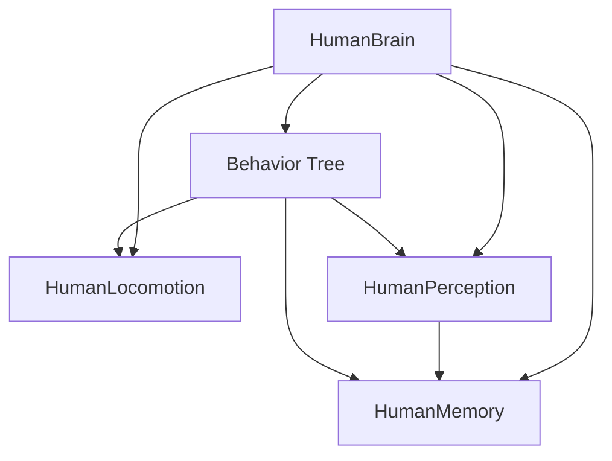

# Life Engine 3D

**Life Engine 3D** is an experimental 3D artificial-life simulation built in Unity. Autonomous human agents perceive and remember their environment, manage physiological needs, seek thermal comfort and shelter, gather resources, craft tools, and interact with a dynamic world through a custom behavior-tree architecture.

The project explores how relatively simple local rules, drives, perception, memory, and physical constraints can produce complex agent behavior.

## Current Capabilities

* Autonomous agents driven by a custom priority-based behavior tree
* Hunger and sleep modeled through internal metabolic variables
* Temperature perception, shade detection, and thermal-comfort behavior
* Vision, hearing, threat memory, and environmental perception
* Physics-based locomotion using NavMesh pathfinding and custom steering
* Resource gathering, tree felling, and item handling
* Tool crafting and multi-output resource conversion
* Shelter seeking, campfire use, fleeing, eating, sleeping, and wandering
* Adjustable simulation speed for observing behavior at accelerated timescales

## Architecture


```mermaid
graph TD
    HB[HumanBrain] --> BT[Behavior Tree]
    HB --> HL[HumanLocomotion]
    HB --> HP[HumanPerception]
    HB --> HM[HumanMemory]

    HP --> HM
    BT --> HL
    BT --> HP
    BT --> HM
```

[`HumanBrain.cs`](Assets/Scripts/Humans/HumanBrain.cs) acts as the central coordinator for each simulated human. The behavior tree determines what an agent is currently trying to do, while locomotion, perception, and memory provide the systems required to execute those decisions.

## Agent Systems

### Human Brain and Internal Drives

[`HumanBrain.cs`](Assets/Scripts/Humans/HumanBrain.cs) manages agent state, physiological drives, environmental evaluation, and high-level behavior.

**Metabolic drives**

* **Adenosine — sleep:** accumulates at `5.625 nM` per in-game hour while awake and clears at `11.25 nM` per hour while sleeping.
* **Ghrelin — hunger:** accumulates at `140 pg/mL` per hour, with food-seeking behavior triggered after crossing the configured hunger threshold.

**Thermal comfort**

* Default comfort range: `18°C–26°C`
* Agents evaluate ambient and perceived temperature when deciding whether to seek shade or warmth.
* A five-point silhouette raycast checks whether the body is fully shaded from direct sunlight.
* Full shade reduces perceived temperature by `10°C`.
* Temperature changes are smoothed with `Mathf.MoveTowards` and a `2°C` hysteresis buffer to avoid unstable state switching.

### Locomotion and Physics Steering

[`HumanLocomotion.cs`](Assets/Scripts/Humans/HumanLocomotion.cs) combines Unity NavMesh pathfinding with custom physical steering.

The `NavMeshAgent` is used primarily for path calculation, while actual movement is handled separately to remain stable at accelerated simulation speeds.

Current steering systems include:

* **Corridor flaring:** shifts movement away from nearby NavMesh edges to reduce wall clipping.
* **Predictive wall avoidance:** angled bumper rays detect obstacles before collision.
* **Local agent repulsion:** nearby humans exert horizontal separation forces to reduce overlap.
* **Velocity smoothing:** blends movement updates to reduce high-frequency jitter.
* **NavMesh clamping:** corrects physical drift away from valid navigable space.
* **Stuck detection:** monitors whether the agent is making meaningful progress toward its target.
* **Rescue nudges:** applies a small corrective repositioning and recalculates the path when navigation becomes trapped.

The system is designed to remain usable at simulation multipliers of up to approximately `8×`.

### Perception and Memory

[`HumanPerception.cs`](Assets/Scripts/Humans/HumanPerception.cs) controls how agents detect their surroundings.

Current perception includes:

* `15m` visual radius
* `200°` field of view
* line-of-sight obstruction raycasts
* target-specific raycast heights
* `2m` omnidirectional hearing radius
* detection of nearby resources, humans, threats, and environmental objects
* preference for already-dropped resources before harvesting new sources

[`HumanMemory.cs`](Assets/Scripts/Humans/HumanMemory.cs) allows agents to retain information that is no longer directly visible.

Threat positions are remembered temporarily and nearby remembered positions are merged to avoid accumulating redundant observations.

## Resources, Tools, and Recipes

The resource system is defined through [`ResourceRegistry.cs`](Assets/Scripts/World/ResourceRegistry.cs) and [`ResourceType.cs`](Assets/Scripts/World/ResourceType.cs).

Current physical resources include:

* Logs in multiple size classes
* Sticks in multiple size classes
* Stones
* Sharpened stones

Recipes can transform resources into tools or other resources.

The crafting system supports **multi-output conversions**. For example, an agent that needs a smaller piece of wood can process a larger resource while preserving the remaining material as additional outputs rather than destroying the excess.

Agents can therefore reason through simple resource-conversion chains when the exact material required by a task is not immediately available.

## Behavior Tree

Agents evaluate behaviors in priority order.

| Priority | Behavior        | Description                                                          |
| -------: | --------------- | -------------------------------------------------------------------- |
|        0 | Sleep           | Seek shelter or sleep when sleep pressure becomes sufficiently high  |
|        1 | Flee            | React to remembered or currently perceived threats                   |
|        2 | Eat             | Search for and consume food when hungry                              |
|        3 | Seek Shelter    | Find shelter in response to environmental conditions                 |
|        4 | Thermal Comfort | Seek shade when hot or warmth when cold                              |
|        5 | Fell Tree       | Acquire or craft the required tool and harvest wood                  |
|        6 | Wander          | Explore the local environment when no higher-priority need is active |

Thermal-comfort behavior can itself lead to additional actions. A cold agent may seek an existing heat source or initiate the resource and crafting chain required to create a campfire.

The behavior tree is intentionally modular: higher-level goals can invoke perception, navigation, resource gathering, and crafting systems rather than implementing those mechanisms independently.

## Project Structure

```text
Assets/
├── Scripts/
│   ├── Humans/
│   │   ├── Behaviors/
│   │   ├── HumanBrain.cs
│   │   ├── HumanLocomotion.cs
│   │   ├── HumanMemory.cs
│   │   └── HumanPerception.cs
│   └── World/
│       ├── ResourceRegistry.cs
│       ├── ResourceType.cs
│       ├── ResourceItem.cs
│       ├── FellableTree.cs
│       ├── FruitTree.cs
│       ├── HeatSource.cs
│       └── DayNightCycle.cs
├── Scenes/
└── ...

Packages/
ProjectSettings/
```

## Getting Started

### Requirements

* **Unity `6000.3.12f1`**
* A system capable of running a Unity 3D project

### Running the Simulation

1. Clone or download the repository.
2. Open the project in Unity `6000.3.12f1`.
3. Open `Assets/Scenes/SampleScene.unity`.
4. Enter Play Mode.
5. Select human agents to inspect their current internal state and active behavior.
6. Use the simulation controls to change the time scale and observe behavior over longer periods.

## Project Status

Life Engine 3D is an experimental prototype rather than a finished game or general-purpose artificial-life framework.

The current project focuses on constructing increasingly capable autonomous agents and studying the interactions between:

* internal drives,
* perception,
* memory,
* decision-making,
* navigation,
* environmental constraints,
* resource acquisition,
* and tool use.

Many systems remain deliberately simplified. The value of the project is primarily in exploring how these components interact and what behaviors emerge as additional constraints and capabilities are introduced.

## License

This project is licensed under the [GNU Affero General Public License v3.0](LICENSE).
