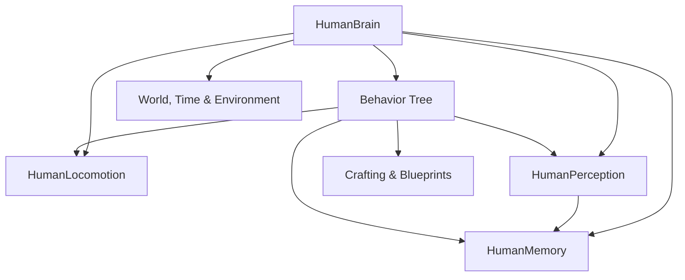

# Life Engine 3D

**Life Engine 3D** is an experimental 3D artificial-life simulation built in Unity. Autonomous human agents perceive and remember their environment, manage internal physiological needs, seek thermal comfort and shelter, gather resources, craft tools, and interact with a dynamic world through a priority-based behavior-tree architecture.

The project explores how local rules, metabolic drives, perception, memory, and physical constraints produce emergent agent behaviors in a real-time 3D environment.

---

## Current Capabilities

* **Priority-Based AI**: Autonomous human agents driven by an extensible behavior-tree architecture.
* **Internal Metabolic Drives**: Sleep pressure (adenosine) and hunger (ghrelin) modeled continuously over game time.
* **Thermal Comfort & Solar Exposure**: Dynamic diurnal ambient temperatures, 5-point silhouette shade detection from sunlight, and proximity-based heat sources.
* **Sensory Perception & Spatial Memory**: Visual field of view ($200^\circ$), line-of-sight obstruction raycasts, hearing, and short-term threat memory.
* **Decoupled Physics Locomotion**: Hybrid NavMesh path calculation and Rigidbody steering with corridor flaring, local agent repulsion, bumper rays, velocity smoothing, and progress-based stuck recovery.
* **Resource Gathering & Conversion**: Living tree felling, dropped resource collection, and multi-output material splitting (e.g., splitting large logs into smaller logs and sticks).
* **Progressive Blueprint Crafting**: In-world construction sites with staged visual progression and strict resource conservation.
* **Dynamic World Environment**: Diurnal temperature curves, astronomical sun/moon cycles with ambient lighting and fog transitions, and interactive campfires.
* **Accelerated Timescale & Live Debugging**: Simulation playback controls ($1\times - 64\times$) and a real-time behavior tree visualizer window.

---

## High-Level Architecture

```mermaid
graph TD
    HB[HumanBrain] --> BT[Behavior Tree]
    HB --> HL[HumanLocomotion]
    HB --> HP[HumanPerception]
    HB --> HM[HumanMemory]

    HP --> HM
    BT --> HL
    BT --> HP
    BT --> HM
    BT --> Crafting[Crafting & Blueprints]
    HB --> World[World, Time & Environment]
```

[`HumanBrain.cs`](Assets/Scripts/Humans/HumanBrain.cs) serves as the central coordinator for each simulated human, executing the behavior tree on `Update()`. Locomotion, perception, and memory provide the underlying sensory and physical systems required to realize decisions.

---

## Documentation

Comprehensive technical documentation is available in the [`docs/`](docs/) directory:

* **[Architecture Overview](docs/ARCHITECTURE.md)**: System design, Mermaid architecture diagram, ownership boundaries, and runtime execution loops.
* **[Simulation Model & Dynamics](docs/SIMULATION_MODEL.md)**: Mathematical formulas, biological drives (adenosine/ghrelin), thermal equations, physics steering, and units.
* **[System Documentation](docs/systems/)**:
  * [Behavior Tree](docs/systems/behavior-tree.md)
  * [Physiology & Drives](docs/systems/physiology.md)
  * [Locomotion & Steering](docs/systems/locomotion.md)
  * [Perception](docs/systems/perception.md)
  * [Memory](docs/systems/memory.md)
  * [Resources & Inventory](docs/systems/resources-and-inventory.md)
  * [Crafting & Blueprints](docs/systems/crafting.md)
  * [Thermal Comfort](docs/systems/thermal-comfort.md)
  * [World, Environment & Time](docs/systems/world-and-time.md)
* **[System Invariants](docs/INVARIANTS.md)**: Critical architectural invariants, resource conservation guarantees, and ownership rules.
* **[Development Guide](docs/DEVELOPMENT.md)**: Contributor guide, project structure, component workflows, and Unity configuration.
* **[Debugging & Diagnostics](docs/DEBUGGING.md)**: Visual debug rays, Scene View gizmos, editor debugger window, and troubleshooting.
* **[Planet Implementation Plan](docs/plans/planet-implementation-plan.md)**: Future architectural roadmap for procedural flat planet generation.
* **[Changelog](CHANGELOG.md)**: Version history, unreleased fixes, and project milestones.
* **[Agent Guidelines](AGENTS.md)**: Rules and conventions for AI coding agents and human contributors.

---

## Getting Started

### Requirements
* **Unity Version**: `6000.3.12f1` (Unity 6)
* Universal Render Pipeline (URP `17.3.0`)

### Running the Simulation
1. Clone or download the repository.
2. Open the project in Unity `6000.3.12f1`.
3. Open the main scene: [`Assets/Scenes/SampleScene.unity`](Assets/Scenes/SampleScene.unity).
4. Enter **Play Mode**.
5. Left-click human agents to select and inspect their internal state.
6. Open **Window $\rightarrow$ Life Engine $\rightarrow$ Behavior Tree Debugger** to watch agent decision-making live.
7. Use the runtime controls to pause (`Spacebar`), reset speed (`Enter`), or accelerate simulation time (`+` / `-`).

---

## Project Status

Life Engine 3D is an active research and development prototype. The simulation focuses on building increasingly capable autonomous agents and exploring how simple local rules, metabolic pressures, physical navigation, and environmental dynamics interact.

Planned long-term features—such as procedural tectonic flat planet generation—are documented in [`docs/plans/planet-implementation-plan.md`](docs/plans/planet-implementation-plan.md) and represent future development rather than completed systems.

---

## License

This project is licensed under the [GNU Affero General Public License v3.0](LICENSE).
