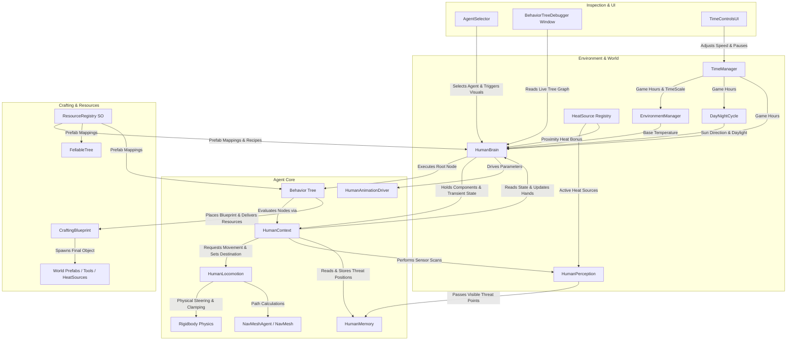

# System Architecture

## Overview

**Life Engine 3D** is an agentic artificial-life simulation where autonomous humanoid agents interact with a dynamic physical environment. The architecture decouples high-level decision-making (Behavior Trees), physical locomotion and steering (NavMesh + Rigidbody physics), sensory perception (Raycasting + FOV), memory, and environmental systems.

---

## Architectural Diagram

The diagram below illustrates the actual runtime relationships and data flow between components:

---

## Component Responsibilities & Relationships

### 1. Agent Decision & Drive Core
* **[`HumanBrain`](file:///c:/UnityProjects/LifeEngine/Assets/Scripts/Humans/HumanBrain.cs)**: Central coordinator for the agent. Owns metabolic variables (adenosine for sleep, ghrelin for hunger), authoritative thermal evaluation (`currentThermalStatus`), carried inventories (`ResourceStack` inventory and `toolInventory`), hand visual slots, and the behavior tree lifecycle.
* **[`HumanContext`](file:///c:/UnityProjects/LifeEngine/Assets/Scripts/Humans/Behaviors/HumanBehaviors.cs)**: Transient data container instantiated per agent. Passed into all behavior tree nodes to provide direct access to `Brain`, `Locomotion`, `Perception`, and `Memory`, as well as holding in-flight task data (timers, target transforms, placement vectors).
* **Behavior Tree Engine ([`BehaviorTree.cs`](file:///c:/UnityProjects/LifeEngine/Assets/Scripts/AI/BehaviorTree.cs))**: Custom hierarchical behavior tree implementation containing composite nodes (`Selector`, `Sequence`) and `ActionNode` delegates. Evaluated every frame from the root.

### 2. Locomotion & Physics
* **[`HumanLocomotion`](file:///c:/UnityProjects/LifeEngine/Assets/Scripts/Humans/HumanLocomotion.cs)**: Decoupled navigation and steering controller. Uses a `NavMeshAgent` solely for geometric path generation (`updatePosition = false`, `updateRotation = false`), while applying physical steering forces, obstacle repulsion, wall bumpers, corridor flaring, velocity smoothing, and progress-based stuck detection to the `Rigidbody`.
* **[`HumanAnimationDriver`](file:///c:/UnityProjects/LifeEngine/Assets/Scripts/Humans/HumanAnimationDriver.cs)**: Bridges planar velocity, sleep state, carrying state, and thermal discomfort flags to the Unity `Animator` controller.

### 3. Perception & Memory
* **[`HumanPerception`](file:///c:/UnityProjects/LifeEngine/Assets/Scripts/Humans/HumanPerception.cs)**: Sensory scanner using physics sphere overlaps, horizontal FOV checks (200°), omnidirectional hearing (2m), and line-of-sight raycasts with target-specific vertical offsets.
* **[`HumanMemory`](file:///c:/UnityProjects/LifeEngine/Assets/Scripts/Humans/HumanMemory.cs)**: Short-term spatial memory for perceived threats. Automatically merges spatially proximate threat positions and prunes expired records.

### 4. World, Time & Environment
* **[`TimeManager`](file:///c:/UnityProjects/LifeEngine/Assets/Scripts/World/TimeManager.cs)**: Singleton clock managing in-game hours, days, real-time conversion ratios, and global simulation timescale multipliers.
* **[`EnvironmentManager`](file:///c:/UnityProjects/LifeEngine/Assets/Scripts/World/EnvironmentManager.cs)**: Singleton evaluating the diurnal ambient temperature curve (Celsius) against the current game hour.
* **[`DayNightCycle`](file:///c:/UnityProjects/LifeEngine/Assets/Scripts/World/DayNightCycle.cs)**: Singleton controlling celestial rotation, sunlight color/intensity, ambient lighting, and distance fog.
* **[`HeatSource`](file:///c:/UnityProjects/LifeEngine/Assets/Scripts/World/HeatSource.cs)**: World object emitting radial heat with linear falloff. Automatically registers with a static global list (`HeatSource.ActiveSources`) for high-performance querying.

### 5. Crafting & World Resources
* **[`ResourceRegistry`](file:///c:/UnityProjects/LifeEngine/Assets/Scripts/World/ResourceRegistry.cs)**: ScriptableObject database defining resource enums ([`ResourceType`](file:///c:/UnityProjects/LifeEngine/Assets/Scripts/World/ResourceType.cs)), visual hand prefabs, physical world drop prefabs, tool mappings, and recipes.
* **[`CraftingBlueprint`](file:///c:/UnityProjects/LifeEngine/Assets/Scripts/Crafting/CraftingBlueprint.cs)**: Placed in the world during construction. Manages staged visual feedback, validates resource deliveries, accepts partial quantities, and instantiates the finished prefab upon completion.
* **[`FellableTree`](file:///c:/UnityProjects/LifeEngine/Assets/Scripts/World/FellableTree.cs)** & **[`FruitTree`](file:///c:/UnityProjects/LifeEngine/Assets/Scripts/World/FruitTree.cs)**: Interactive harvesting sources that spawn resources upon timed interaction.

---

## State Ownership Boundaries

Clear ownership rules ensure determinism and prevent race conditions across systems:

| State Domain | Authoritative Owner | Non-Owners (Read-Only / Request-Only) |
| :--- | :--- | :--- |
| **Metabolic State** (Adenosine, Ghrelin, Sleeping) | [`HumanBrain`](file:///c:/UnityProjects/LifeEngine/Assets/Scripts/Humans/HumanBrain.cs) | Behavior tree nodes inspect values; `SleepNode`/`EatFoodNode` modify via Brain API |
| **Thermal State** (`perceivedTemperature`, `currentThermalStatus`, `isInShade`) | [`HumanBrain.UpdateThermalState()`](file:///c:/UnityProjects/LifeEngine/Assets/Scripts/Humans/HumanBrain.cs) | Behavior tree nodes (e.g., `NeedsWarmthNode`) evaluate `currentThermalStatus` enum |
| **Physical Locomotion & Stuck State** | [`HumanLocomotion`](file:///c:/UnityProjects/LifeEngine/Assets/Scripts/Humans/HumanLocomotion.cs) | Behavior nodes invoke `SetDestination()` / `Stop()` and query `IsCurrentlyStuck` |
| **Threat Spatial Memory** | [`HumanMemory`](file:///c:/UnityProjects/LifeEngine/Assets/Scripts/Humans/HumanMemory.cs) | `HumanPerception` provides raw observation points; `FleeNode` reads active positions |
| **Inventory & Carried Tools** | [`HumanBrain`](file:///c:/UnityProjects/LifeEngine/Assets/Scripts/Humans/HumanBrain.cs) | Action nodes add/remove items through `AddResource()`, `RemoveResource()` |
| **Blueprint Construction Progress** | [`CraftingBlueprint`](file:///c:/UnityProjects/LifeEngine/Assets/Scripts/Crafting/CraftingBlueprint.cs) | `DeliverResourceNode` calls `AddResource()` and receives accepted quantity count |
| **World Time & Timescale** | [`TimeManager`](file:///c:/UnityProjects/LifeEngine/Assets/Scripts/World/TimeManager.cs) | `TimeControlsUI` requests changes; all systems read `currentTimeHours` / `realSecondsPerGameMinute` |
| **Base Ambient Temperature** | [`EnvironmentManager`](file:///c:/UnityProjects/LifeEngine/Assets/Scripts/World/EnvironmentManager.cs) | `HumanBrain` reads `BaseTemperature` |

---

## Runtime Execution Model

### 1. `Update()` Phase (Frame-Rate Dependent & Scaled Time)
1. **Time Progression**: `TimeManager` accumulates `currentTimeHours` using `Time.unscaledDeltaTime` scaled by `timeScaleMultiplier`.
2. **Environment Updates**: `EnvironmentManager` evaluates ambient temperature curve; `DayNightCycle` rotates directional light and updates skybox/fog gradients.
3. **Agent Physiology**: If awake, `HumanBrain` increments `adenosineConcentration` and `ghrelinConcentration`.
4. **Thermal Evaluation**: `HumanBrain.UpdateThermalState()` performs 5-point silhouette shade raycasts, scans heat sources via `HumanPerception.PerformHeatSourceScan()`, moves `perceivedTemperature` toward target, and updates `currentThermalStatus` with hysteresis.
5. **Memory Pruning**: `HumanMemory.Update()` purges expired threat entries.
6. **Behavior Tree Evaluation**: `HumanBrain` resets the root tree (`rootNode.ResetState()`) and traverses the tree (`rootNode.Evaluate()`).
7. **Animation Driving**: `HumanAnimationDriver` samples planar velocity and states to update `Animator` floats and booleans.

### 2. `FixedUpdate()` Phase (Physics Cadence)
1. **Path Tracking**: `HumanLocomotion` samples `NavMeshAgent.steeringTarget` for the active path corner.
2. **Corridor Flaring**: If within 0.45m of a NavMesh boundary edge, flares the steering target along the edge normal by 0.25m.
3. **Local Avoidance & Bumpers**: Executes `OverlapSphereNonAlloc` to calculate horizontal repulsion against nearby agents, and fires left/right 35° bumper raycasts for predictive obstacle avoidance.
4. **Velocity Blending & Smoothing**: Blends steering direction with transform forward, clamps against NavMesh geometry via `NavMesh.Raycast` projection, suppresses oscillation, and applies low-pass smoothing (`rb.linearVelocity = Lerp(rb.linearVelocity, vel, 0.3f)`).
5. **Stuck Progress Evaluation**: Every 0.4 seconds of movement, compares progress against target destination. If progress < 0.05m and speed < 0.2m/s, triggers `PerformRescue()` and increments stuck counter.
6. **Position Synchronization**: Clamps drift > 0.1m back to NavMesh via `NavMesh.SamplePosition`, and syncs `agent.nextPosition = rb.position`.

---

## Current Architectural Limitations & Technical Debt

1. **Global Scene Scans in Behavior Nodes**: Several action nodes (`FindHarvestableSourceNode`, `FindToolOnGroundNode`, `FindShadeSpotNode`) call `Object.FindObjectsByType<T>()` rather than utilizing the sensory perception pipeline (`HumanPerception`).
2. **Hard-Coded Physics & Layer Assumptions**: Multiple systems use hard-coded bitwise shifts (`1 << 6` for walls, `1 << 9` for trees, `1 << 0` for default, `1 << 3` for room NavMesh area) rather than exposed `LayerMask` properties.
3. **Single-Target Perception Focus**: `HumanPerception` caches only a single `primaryThreat` and `primaryFood` transform per scan cycle.
4. **Restricted Memory Domain**: `HumanMemory` only tracks threat coordinates; agents possess no persistent memory for food sources, dropped tools, or resource clusters.
5. **Hard-Coded Tool Visuals**: `HumanBrain.UpdateToolVisual()` explicitly checks and instantiates only `"Basic_Axe"`.
