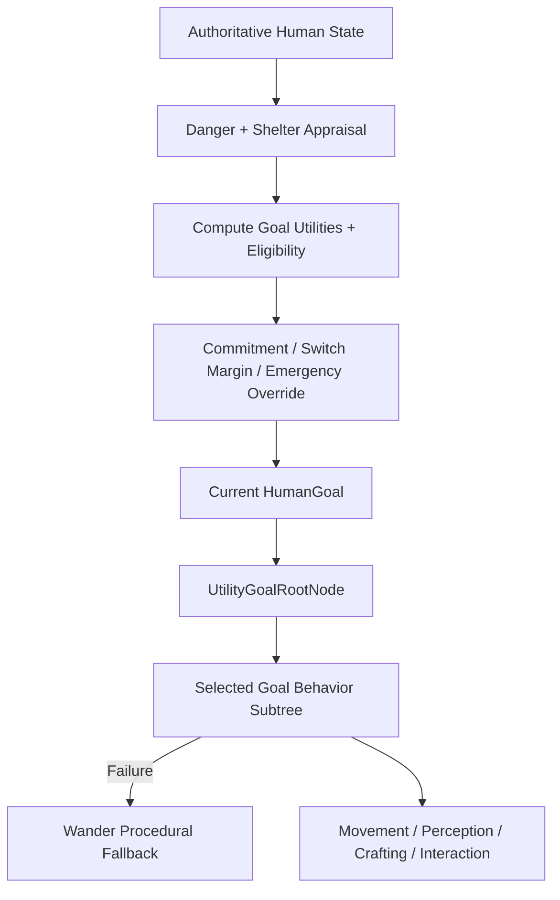

# Goal Arbitration & Behavior Tree System

## Purpose
Human decision-making uses a hybrid architecture:

1. **Utility arbitration** decides which top-level goal currently matters most.
2. **Behavior trees** execute the procedural steps required to pursue that selected goal.

This separates motivation ("what should I do?") from execution ("how do I do it?") and avoids encoding human needs as a fixed priority ladder.

---

## Responsibilities
* Convert authoritative human state into normalized utility scores for competing goals.
* Select one eligible `HumanGoal` while preventing rapid goal thrashing.
* Allow visible danger to pre-empt normal goals immediately.
* Execute the selected goal through the existing behavior-tree sequences.
* Fall back to wandering when the selected goal cannot currently act.
* Maintain transient task context in `HumanContext`.
* Provide live diagnostic state to the Unity Inspector and Behavior Tree Debugger.

---

## Non-Responsibilities
* Does **not** own physiological concentrations, thermal state, inventories, perception, memory, or locomotion.
* Does **not** implement GOAP/HTN planning.
* Does **not** make behavior-tree leaf nodes authoritative for top-level motivation.

---

## Main Files
* [`Assets/Scripts/Humans/HumanBrain.cs`](file:///c:/UnityProjects/LifeEngine/Assets/Scripts/Humans/HumanBrain.cs): Updates appraisal state, computes goal eligibility/utilities, selects the current goal, builds goal subtrees, and evaluates the stable root.
* [`Assets/Scripts/Humans/HumanGoalUtility.cs`](file:///c:/UnityProjects/LifeEngine/Assets/Scripts/Humans/HumanGoalUtility.cs): `HumanGoal`, telemetry records, pure utility scoring helpers, switch-guard logic, and the stable `UtilityGoalRootNode`.
* [`Assets/Scripts/Humans/Behaviors/HumanBehaviors.cs`](file:///c:/UnityProjects/LifeEngine/Assets/Scripts/Humans/Behaviors/HumanBehaviors.cs): Goal execution nodes and shared `HumanContext`.
* [`Assets/Scripts/AI/BehaviorTree.cs`](file:///c:/UnityProjects/LifeEngine/Assets/Scripts/AI/BehaviorTree.cs): Core behavior-tree primitives (`Node`, `Sequence`, `Selector`, `ActionNode`).
* [`Assets/Editor/BehaviorTreeDebugger.cs`](file:///c:/UnityProjects/LifeEngine/Assets/Editor/BehaviorTreeDebugger.cs): Live visualization of the stable utility root and all goal subtrees.

---

## Human Goals

The implemented top-level goals are:

* `Flee`
* `Sleep`
* `Eat`
* `SeekShelter`
* `WarmUp`
* `CoolDown`
* `FellTree` (test-mode goal)
* `Wander`

`None` exists as an initialization/sentinel value.

The order above is used only as deterministic tie-breaking/debug ordering. It is **not** a fixed priority ladder.

---

## Utility Scoring

Each frame, `HumanBrain` refreshes telemetry for every goal. A score has:

* `goal`
* `utility` in the range `0..1`
* `eligible`

Eligibility preserves important activation semantics while utility determines competition between simultaneously active needs.

### Hunger
`HumanGoalUtility.Hunger()` maps ghrelin approximately as:

* 500 pg/mL → 0.0
* hunger threshold (1200 pg/mL default) → 0.5
* 1600 pg/mL → 1.0

Eating becomes eligible at the existing ghrelin hunger threshold, or while a food target/eating action is already in flight.

### Sleep
`HumanGoalUtility.Sleep()` maps adenosine approximately as:

* 10 nM → 0.0
* 100 nM → 0.8
* 120 nM → 1.0

Sleep becomes eligible at 100 nM and remains eligible while the human is sleeping.

### Thermal Comfort
Thermal eligibility is controlled by the authoritative `HumanBrain.currentThermalStatus`.

* `Cold` enables `WarmUp`.
* `Hot` enables `CoolDown`.
* `Comfortable` disables both.

Severity increases the utility as perceived temperature moves farther outside the comfort range. Utility scoring does not replace or duplicate thermal-state authority.

### Danger
Visible danger produces utility `1.0`.

After a threat leaves perception, danger utility decays with the existing panic-persistence timer until the flee goal becomes ineligible.

### Shelter
Shelter appraisal is updated before goal arbitration. Once the existing outside-room comfort timer expires, `SeekShelter` becomes eligible with a utility of `0.6`.

### Fell Tree Test
When `startFellingTest` is enabled, the test goal becomes eligible with low utility (`0.25`) so normal survival needs can still override it.

### Wander
Wander is the zero-utility fallback whenever the human is awake and no stronger eligible motivation wins.

---

## Arbitration

Normal arbitration is controlled by:

* `goalEvaluationInterval = 0.20s`
* `minimumGoalCommitmentSeconds = 0.75s`
* `goalSwitchMargin = 0.10`

A normal candidate must:

1. be eligible,
2. be the highest-scoring eligible goal,
3. wait until the current commitment window has expired, and
4. exceed the current goal by the configured switch margin.

If the current goal becomes ineligible, it can be abandoned immediately.

A visible threat is an emergency override and selects `Flee` immediately without waiting for the normal arbitration interval, commitment window, or score margin.

---

## Execution Flow

The root remains one stable node so editor/debug tooling does not need to rebuild its graph whenever the current goal changes.

---

## Goal Behavior Subtrees

### Sleep
`NeedsSleepNode → SleepNode`

### Flee
`CheckDangerNode → FleeNode`

Threat sensing and panic persistence are updated before arbitration; `CheckDangerNode` now verifies the authoritative danger appraisal instead of owning that appraisal itself.

### Eat
`NeedsFoodNode → SeesFoodNode → EatFoodNode`

If hunger is selected but no food is perceptible, the subtree can fail and Wander is used procedurally while the hunger motivation remains selected.

### Shelter
`NeedsShelterNode → SeekShelterNode`

Shelter comfort timing is updated before arbitration. `NeedsShelterNode` reads the resulting authoritative appraisal.

### Warm Up
`NeedsWarmthNode → Find or Build Fire`

The execution path first attempts to use an existing heat source and falls back to campfire construction.

### Cool Down
`Check Is Hot → FindShadeSpotNode → MoveToShadeNode`

### Fell Tree Test
The existing tool acquisition, crafting fallback, harvest-source search, and felling sequence remains intact.

### Wander
`WanderNode`

---

## Runtime Telemetry

`HumanBrain` exposes:

* `CurrentGoal`
* `CurrentGoalUtility`
* `CurrentGoalRetainedByCommitment`
* `GoalScores`
* `GetGoalUtility(HumanGoal)`
* `IsGoalEligible(HumanGoal)`
* `HasVisibleThreat`
* `HasActiveDanger`
* `NeedsShelter`
* `ShelterComfortRemaining`

This state is intended for debugging and future runtime UI without requiring UI code to inspect private behavior-tree internals.

---

## Behavior Tree Evaluation Semantics

The behavior tree remains stateless across frames:

1. `HumanBrain` updates physiology, thermal state, danger, shelter, and goal arbitration.
2. `rootNode.ResetState()` resets composite/leaf node state.
3. `rootNode.Evaluate()` executes the selected goal subtree.
4. Multi-frame task progress remains in timestamps or `HumanContext`.

Nodes must remain interruptible because another goal can become active on a later arbitration pass.

---

## Known Limitations
* Utility curves are intentionally simple first-pass mappings rather than validated biological/psychological models.
* Shelter currently uses a binary utility once its grace timer expires.
* The system chooses goals but does not automatically synthesize action plans; complex crafting still uses manually authored behavior-tree sequences.
* Several execution nodes still rely on bounded scene/perception queries documented elsewhere.

---

## Debugging
* Inspect `Current Goal`, `Current Goal Utility`, `Current Goal Retained By Commitment`, and `Goal Scores` on `HumanBrain`.
* `currentStateDisplay` includes the selected goal and utility before the behavior-tree state dump.
* Open **Window → Life Engine → Behavior Tree Debugger** to see the stable utility root and all procedural goal subtrees.
