# Behavior Tree System

## Purpose
The Behavior Tree system provides a modular, priority-driven decision-making architecture for autonomous human agents. It enables complex, reactive behavior by decomposing agent logic into reusable composite and leaf action nodes.

---

## Responsibilities
* Orchestrate agent decisions across competing physiological drives, environmental conditions, threats, and crafting goals.
* Evaluate hierarchical composite nodes (`Selector`, `Sequence`) and execute leaf action nodes.
* Maintain transient task context ([`HumanContext`](file:///c:/UnityProjects/LifeEngine/Assets/Scripts/Humans/Behaviors/HumanBehaviors.cs)) across frame evaluations.
* Provide diagnostic visualization hooks for real-time editor debugging.

---

## Non-Responsibilities
* Does **not** compute physical steering forces or execute path calculations (delegated to [`HumanLocomotion`](file:///c:/UnityProjects/LifeEngine/Assets/Scripts/Humans/HumanLocomotion.cs)).
* Does **not** own internal physiological variables, inventories, or thermal calculations (owned by [`HumanBrain`](file:///c:/UnityProjects/LifeEngine/Assets/Scripts/Humans/HumanBrain.cs)).
* Does **not** store persistent world memory across sessions.

---

## Main Files
* [`Assets/Scripts/AI/BehaviorTree.cs`](file:///c:/UnityProjects/LifeEngine/Assets/Scripts/AI/BehaviorTree.cs): Core behavior tree framework (`Node`, `NodeState`, `Sequence`, `Selector`, `ActionNode`).
* [`Assets/Scripts/Humans/Behaviors/HumanBehaviors.cs`](file:///c:/UnityProjects/LifeEngine/Assets/Scripts/Humans/Behaviors/HumanBehaviors.cs): Simulation-specific action nodes and the shared `HumanContext` definition.
* [`Assets/Scripts/Humans/HumanBrain.cs`](file:///c:/UnityProjects/LifeEngine/Assets/Scripts/Humans/HumanBrain.cs): Builds and evaluates the root human behavior tree.
* [`Assets/Editor/BehaviorTreeDebugger.cs`](file:///c:/UnityProjects/LifeEngine/Assets/Editor/BehaviorTreeDebugger.cs): Editor window rendering tree graphs and node states in real time.

---

## State / Data
* **[`NodeState`](file:///c:/UnityProjects/LifeEngine/Assets/Scripts/AI/BehaviorTree.cs)**:
  * `Idle`: Initial or reset state.
  * `Running`: Node is currently performing an asynchronous or multi-frame task.
  * `Success`: Node conditions were satisfied or task finished successfully.
  * `Failure`: Node conditions were not met or task aborted.
* **[`HumanContext`](file:///c:/UnityProjects/LifeEngine/Assets/Scripts/Humans/Behaviors/HumanBehaviors.cs)**: Shared context passed to all nodes, storing component references and active in-flight task variables (`PanicTimer`, `EatingTimer`, `FellingTimer`, `CraftingTimer`, target transforms, vectors).

---

## Human Behavior Tree Hierarchy

The human decision tree evaluates behaviors in strict priority order (Priority 0 to Priority 6):

```mermaid
graph TD
    Root{{"Human Behavior (Selector)"}}

    Root --> P0["0. Sleep Sequence (Sequence)"]
    P0 --> P0_A("Needs Sleep")
    P0 --> P0_B("Sleeping")

    Root --> P1["1. Flee Sequence (Sequence)"]
    P1 --> P1_A("Check For Danger")
    P1 --> P1_B("Flee Target")

    Root --> P2["2. Eat Sequence (Sequence)"]
    P2 --> P2_A("Needs Food")
    P2 --> P2_B("Spot Food")
    P2 --> P2_C("Eating Food")

    Root --> P3["3. Seek Shelter Sequence (Sequence)"]
    P3 --> P3_A("Needs Shelter")
    P3 --> P3_B("Seek Shelter")

    Root --> P4{{"4. Thermal Comfort Goals (Selector)"}}
    P4 --> P4_Shade["Seek Shade Branch (Sequence)"]
    P4_Shade --> P4_S1("Check Is Hot")
    P4_Shade --> P4_S2("Find Shade Spot")
    P4_Shade --> P4_S3("Move To Shade")
    P4 --> P4_Warmth["Seek Warmth Branch (Sequence)"]
    P4_Warmth --> P4_W1("Needs Warmth")
    P4_Warmth --> P4_W2{{"Find or Build Fire (Selector)"}}
    P4_W2 --> P4_Fire1["Use Existing Fire (Sequence)"]
    P4_Fire1 --> P4_F1A("Find Heat Source")
    P4_Fire1 --> P4_F1B("Move To Warmth")
    P4_W2 --> P4_Fire2["Build Fire Fallback (Sequence)"]
    P4_Fire2 --> P4_F2A("Set Target: Campfire")
    P4_Fire2 --> CraftTree["Crafting Subtree"]

    Root --> P5["5. Fell Tree Goal (Sequence)"]
    P5 --> P5_A("Check Felling Flag")
    P5 --> P5_B{{"Acquire Basic_Axe (Selector)"}}
    P5_B --> P5_B1("Has Basic_Axe?")
    P5_B --> P5_B2{{"Get On Ground or Build (Selector)"}}
    P5_B2 --> P5_G1["Pick Up Axe (Sequence)"]
    P5_B2 --> P5_G2["Craft Axe Goal (Sequence)"]
    P5_G2 --> P5_G2A("Set Target: Axe")
    P5_G2 --> CraftTree
    P5 --> P5_C["Perform Felling (Sequence)"]
    P5_C --> P5_C1("Find Harvestable Source")
    P5_C --> P5_C2("Harvesting Nature Object")

    Root --> P6["6. Wander Sequence (Sequence)"]
    P6 --> P6_A("Wander")
```

### Generic Crafting Subtree
When crafting is triggered (by campfire or axe goals):
1. `FindPlacementSpotTaskNode`: Finds an empty NavMesh spot $3\text{m}$ in front of the human.
2. `MoveToPlacementNode`: Moves the human to the placement location.
3. `PlaceBlueprintNode`: Spawns the blueprint prefab.
4. `Get Required Resource (Selector)`:
   * **Standard Gathering Loop**: `CheckRecipeNode` $\rightarrow$ `FindResourceNode` $\rightarrow$ `CollectResourceNode` $\rightarrow$ `DeliverResourceNode`.
   * **Conversion Fallbacks**: Multi-output and single-output conversion branches converting larger sticks, logs, or stones into required ingredients.

---

## Public API / Important Methods

* `node.Evaluate()`: Traverses and executes the node, returning `NodeState`.
* `node.ResetState()`: Resets node state to `Idle`. Composite nodes recursively reset all children.
* `node.GetChildren()`: Returns child nodes for tree traversal.
* `node.GetTreeStateAsString(int indentLevel)`: Formats tree state as colored multiline text.
* `node.ToMermaid()`: Exports the entire subtree structure as a Mermaid diagram definition.

---

## Important Invariants
* **Frame-by-Frame Evaluation**: `HumanBrain.Update()` resets and traverses `rootNode` every frame.
* **Preemption Safety**: Nodes must expect to be preempted at any time if higher-priority drives become active.
* **Non-Blocking Action Nodes**: Leaf action nodes performing movement or timed tasks must yield `NodeState.Running` without blocking the main Unity thread.

---

## Configuration & Tunables
* `PanicPersistence`: $4.0\text{s}$ cooldown before panic drops after threat is lost.
* `OutsideRoomComfortDuration`: $10.0\text{s}$ comfort buffer after leaving shelter.
* `WanderRadius`: $10.0\text{m}$ ($4.0\text{m}$ if inside a room area).
* `MinWaitTime` / `MaxWaitTime`: $0.5\text{s} - 2.0\text{s}$ pause between wander pathing.

---

## Known Limitations
* **Global Scene Lookups**: Nodes such as `FindHarvestableSourceNode`, `FindToolOnGroundNode`, and `FindShadeSpotNode` use `Object.FindObjectsByType<T>()` rather than the sensory perception layer.

---

## Debugging
* Monitor real-time node colors in the **Behavior Tree Debugger** (`Window/Life Engine/Behavior Tree Debugger`).
* Use `currentStateDisplay` on `HumanBrain` to see live textual status in the Inspector.
