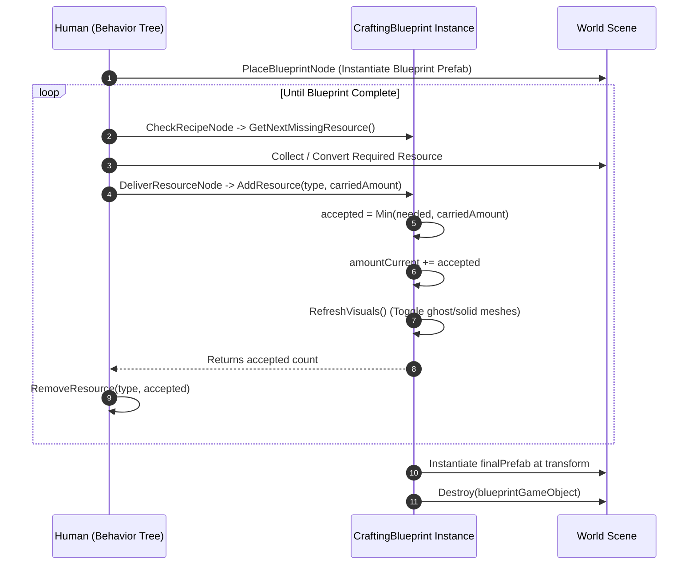

# Crafting & Blueprint System

## Purpose
The Crafting system enables agents to construct world structures (e.g., campfires) and tools (e.g., stone axes) using physical blueprints with progressive visual feedback and multi-output resource conversions.

---

## Responsibilities
* Manage in-world construction sites using [`CraftingBlueprint`](file:///c:/UnityProjects/LifeEngine/Assets/Scripts/Crafting/CraftingBlueprint.cs).
* Progressively toggle ghost/blueprint visuals and solid physical component meshes as resources are delivered.
* Accept partial resource deliveries, calculate exact accepted quantities, and instantiate finished prefabs upon completion.
* Execute multi-output resource conversions ([`ConvertResourceNode`](file:///c:/UnityProjects/LifeEngine/Assets/Scripts/Humans/Behaviors/HumanBehaviors.cs)) to break larger raw materials into smaller required components without losing excess mass.

---

## Non-Responsibilities
* Does **not** perform pathfinding to resources or blueprints (handled by [`HumanLocomotion`](file:///c:/UnityProjects/LifeEngine/Assets/Scripts/Humans/HumanLocomotion.cs)).
* Does **not** manage inventory capacity (owned by [`HumanBrain`](file:///c:/UnityProjects/LifeEngine/Assets/Scripts/Humans/HumanBrain.cs)).

---

## Main Files
* [`Assets/Scripts/Crafting/CraftingBlueprint.cs`](file:///c:/UnityProjects/LifeEngine/Assets/Scripts/Crafting/CraftingBlueprint.cs): Blueprint state machine, visual toggling, and completion spawner.
* [`Assets/Scripts/Humans/Behaviors/HumanBehaviors.cs`](file:///c:/UnityProjects/LifeEngine/Assets/Scripts/Humans/Behaviors/HumanBehaviors.cs): Crafting action nodes (`PlaceBlueprintNode`, `CheckRecipeNode`, `DeliverResourceNode`, `ConvertResourceNode`).
* [`Assets/Scripts/World/ResourceRegistry.cs`](file:///c:/UnityProjects/LifeEngine/Assets/Scripts/World/ResourceRegistry.cs): Defines recipes and prefab mappings.

---

## State / Data

### Blueprint Requirements ([`ResourceRequirement`](file:///c:/UnityProjects/LifeEngine/Assets/Scripts/Crafting/CraftingBlueprint.cs))
* `string label`: Requirement description (e.g., `"Sticks"`).
* `ResourceType type`: Required material enum.
* `int amountRequired`: Total units needed.
* `int amountCurrent`: Current units delivered.
* `GameObject[] blueprintVisuals`: Translucent/ghost meshes disabled progressively as items are added.
* `GameObject[] normalVisuals`: Physical meshes enabled progressively as items are added.
* `bool IsSatisfied => amountCurrent >= amountRequired`.

---

## Execution Flow

### Resource Delivery & Conservation
1. [`DeliverResourceNode`](file:///c:/UnityProjects/LifeEngine/Assets/Scripts/Humans/Behaviors/HumanBehaviors.cs) checks carried inventory count: `amount = Brain.GetResourceCount(neededType)`.
2. Invokes `int accepted = blueprint.AddResource(neededType, amount)`.
3. The blueprint accepts only up to $\text{needed} = \text{amountRequired} - \text{amountCurrent}$.
4. The node calls `Brain.RemoveResource(neededType, accepted)`. Surplus resources remain safely in the agent's inventory.

### Multi-Output Resource Conversion ([`ConvertResourceNode`](file:///c:/UnityProjects/LifeEngine/Assets/Scripts/Humans/Behaviors/HumanBehaviors.cs))
When a specific resource size is unavailable, agents convert larger materials into smaller pieces with secondary byproducts:
* **Stick Splitting**: 1x `Stick_4` $\rightarrow$ 1x `Stick_3` + 1x `Stick_1` (1.0s)
* **Log Splitting**: 1x `Log_4` $\rightarrow$ 1x `Log_3` + 1x `Log_1` (1.0s)
* **Stone Knapping**: 2x `Stone` $\rightarrow$ 1x `Sharpened_Stone` + 1x `Stone` (5.0s)
Outputs are spawned directly at the agent's feet via `Object.Instantiate(registry.GetWorldPrefab(output.type))`.

---

## Public API / Important Methods

* `CraftingBlueprint.GetNextMissingResource(out ResourceType nextType)`: Returns true and outputs the first unsatisfied resource type.
* `CraftingBlueprint.AddResource(ResourceType type, int amount)`: Adds up to needed quantity, refreshes visual stages, checks completion, and returns exact count accepted.
* `CraftingBlueprint.IsComplete()`: Returns true if all requirements are satisfied.

---

## Important Invariants
* **Strict Resource Conservation**: `CraftingBlueprint.AddResource()` must strictly bound acceptance to $\min(\text{needed}, \text{delivered})$, and delivering agents must only deduct what was accepted.
* **Single Completion Trigger**: `Complete()` sets `isCompleted = true` immediately before instantiating `finalPrefab` to prevent duplicate spawns.

---

## Configuration / Tunables
* Prefabs configured in `Assets/Prefabs/Campfires/` and `Assets/Prefabs/Tools/`.
* `deliverDuration`: $1.0\text{s}$ timed delivery interaction in `DeliverResourceNode`.

---

## Known Limitations
* **Fixed Placement Offset**: `FindPlacementSpotTaskNode` always chooses a fixed point $3\text{m}$ in front of the agent.
* **Non-Reclaimable**: Placed blueprints cannot currently be deconstructed or salvaged if an agent abandons construction.

---

## Debugging
* Monitor `DeliverResourceNode` progress in the `BehaviorTreeDebugger` window (`"Adding to project... 70%"`).
* Inspect the `Requirements` list on the blueprint in the Inspector to observe real-time `amountCurrent` increments.
