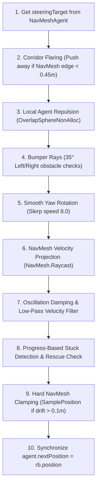

# Locomotion & Physics Steering System

## Purpose
The Locomotion system combines Unity NavMesh pathfinding with custom physical steering to ensure stable, realistic agent movement at both normal and accelerated simulation timescales (up to $8\times - 64\times$).

---

## Responsibilities
* Decouple NavMesh pathfinding from transform updates, using `NavMeshAgent` strictly as a path calculator.
* Drive physical `Rigidbody` movement, wall avoidance, local agent repulsion, and turning.
* Project velocities along NavMesh boundaries and clamp physical drift back to valid navigable areas.
* Own and execute progress-based stuck detection and automated rescue impulses.

---

## Non-Responsibilities
* Does **not** choose target destinations or high-level tactical goals (driven by the Behavior Tree).
* Does **not** handle character animation blending directly (handled by [`HumanAnimationDriver`](file:///c:/UnityProjects/LifeEngine/Assets/Scripts/Humans/HumanAnimationDriver.cs)).

---

## Main Files
* [`Assets/Scripts/Humans/HumanLocomotion.cs`](file:///c:/UnityProjects/LifeEngine/Assets/Scripts/Humans/HumanLocomotion.cs): Main locomotion and physics steering component.
* [`Assets/Scripts/Humans/HumanAnimationDriver.cs`](file:///c:/UnityProjects/LifeEngine/Assets/Scripts/Humans/HumanAnimationDriver.cs): Samples planar velocity from `HumanLocomotion` / `Rigidbody`.

---

## State / Data
* **Speeds**: `walkSpeed = 1.5f` m/s, `runSpeed = 3.5f` m/s.
* **Avoidance & Repulsion**: `avoidanceRadius = 1.5f` m, `avoidanceWeight = 2.0f`.
* **Stuck Detection Parameters**:
  * `stuckDistanceThreshold = 0.3f` m.
  * `stuckTimeThreshold = 1.0f` s.
  * `destinationChangeThreshold = 0.3f` m.
* **Internal State**:
  * `baselineDestination`: Stored target anchor for measuring meaningful distance reduction.
  * `stuckTimer`: Accumulates fixed delta time between progress checks ($0.4\text{s}$ interval).
  * `lastDistanceToTarget`: Distance measured at previous progress check.
  * `consecutiveStuckCount`: Number of consecutive failed progress intervals.
  * `isCurrentlyStuck`: Boolean flag exposed to behavior tree.
  * `rescueActiveTimer` & `rescueNudgeDir`: Active rescue impulse state.

---

## Steering & Physics Pipeline

In every `FixedUpdate()` step, [`HumanLocomotion`](file:///c:/UnityProjects/LifeEngine/Assets/Scripts/Humans/HumanLocomotion.cs) executes the following sequence:

### 1. Decoupled NavMeshAgent & Frictionless Physics
* `agent.updatePosition = false` and `agent.updateRotation = false`: NavMeshAgent does not touch the GameObject transform directly.
* `agent.radius = 0.3m`, while `CapsuleCollider.radius = 0.25m`. This $5\text{cm}$ buffer prevents physical colliders from snagging on wall corners.
* A frictionless physics material (`HumanFrictionless`, friction 0) is applied to the capsule collider so agents slide smoothly off walls.

### 2. Corridor Flaring
When traversing narrow corridors, agents query the nearest NavMesh boundary edge via `NavMesh.FindClosestEdge()`. If within $0.45\text{m}$, the immediate steering target is flared away from the wall along the edge normal by $+0.25\text{m}$, preventing tight corner clipping.

### 3. Predictive Wall Avoidance (Bumper Rays)
Two angled raycasts ($\pm 35^\circ$, length $0.65\text{m}$) fire at head height ($+1.0\text{m}$) against layers `0 (Default)`, `6 (Walls)`, and `9 (Trees)`. Approaching obstacles exert a lateral repulsive steering force away from the hit normal.

### 4. NavMesh Velocity Projection
Before applying velocity, `NavMesh.Raycast` checks for upcoming wall geometry. If a wall is detected, the intended movement vector is projected onto the plane of the wall via `Vector3.ProjectOnPlane`, allowing agents to glide smoothly along walls without bouncing or stalling.

### 5. Velocity Smoothing & Oscillation Damping
* If linear velocity opposes desired movement ($\vec{v}_{\text{linear}} \cdot \vec{v}_{\text{move}} < -0.1$), velocity is damped by $0.25$ to stop high-speed physics solver flutter.
* A low-pass filter blends velocity: `rb.linearVelocity = Vector3.Lerp(rb.linearVelocity, vel, 0.3f)`.

### 6. Hard Position Clamping
If the physics solver drifts $> 0.1\text{m}$ outside valid navigable mesh space, `rb.position` is clamped back to the nearest NavMesh surface sampled within $0.5\text{m}$.

---

## Stuck Detection & Rescue Architecture

### Progress-Based Evaluation
Stuck detection evaluates whether the agent is actually reducing distance to its destination:
* Evaluated every **$0.4\text{ seconds}$** during active movement.
* Measures $\text{progress} = \text{dist}_{\text{last}} - \text{dist}_{\text{current}}$.
* If $\text{progress} < 0.05\text{m}$ **AND** $\|\vec{v}_{\text{linear}}\| < 0.2\text{ m/s}$, the agent is deemed stuck.

### Baseline Destination Semantics
> **Why repeated `SetDestination()` calls do not reset stuck detection:**
> Action nodes in behavior trees often call `SetDestination()` continuously every frame. To prevent this churn from resetting stuck timers and allowing agents to remain trapped indefinitely:
> 1. `HumanLocomotion` tracks `baselineDestination`.
> 2. When `SetDestination(newDest)` is called, it checks $\|\text{baselineDestination} - \text{newDest}\| > \text{destinationChangeThreshold}$ ($0.3\text{m}$).
> 3. If the destination has not changed significantly, the path is refreshed but `stuckTimer` and `lastDistanceToTarget` are **preserved**.
> 4. Only an explicit destination shift $> 0.3\text{m}$ or a `Stop()` call establishes a new progress baseline.

### Rescue Nudges (`PerformRescue()`)
When stuck:
1. `consecutiveStuckCount` is incremented and `isCurrentlyStuck` is set to `true`.
2. A perpendicular impulse direction is calculated ($\vec{n}_{\text{perp}} = \pm \text{transform.right}$).
3. A micro-teleport offset ($0.05\text{m}$) breaks physics contact solver locks (`rb.MovePosition`).
4. A rescue nudge force is applied for $0.5\text{s}$ (`rescueActiveTimer = 0.5f`) with a high speed multiplier ($0.8$).
5. `agent.SetDestination(agent.destination)` forces an immediate NavMesh path refresh.

---

## Public API / Important Methods

* `SetWalk()`: Sets agent speed to `walkSpeed` ($1.5\text{ m/s}$).
* `SetRun()`: Sets agent speed to `runSpeed` ($3.5\text{ m/s}$).
* `Stop()`: Clears NavMesh path, zeroes baseline destination, and resets stuck tracking.
* `SetDestination(Vector3 destination)`: Sets target destination, preserving stuck tracking if destination change $\le 0.3\text{m}$.
* `HasReachedDestination(float tolerance = 0.25f)`: Returns true if remaining distance $\le \text{stoppingDistance} + \text{tolerance}$.
* `IsPathValid(Vector3 targetPosition, out float pathLength)`: Evaluates whether a complete NavMesh path exists to target and calculates its geometric length.
* `IsCurrentlyStuck`: Property returning current stuck state.
* `GetConsecutiveStuckCount()`: Returns consecutive failed progress intervals.
* `ClearStuckCount()`: Clears stuck counter and resets `isCurrentlyStuck` to false.

---

## Important Invariants
* **Sole Ownership**: `HumanLocomotion` is the exclusive owner of stuck detection state and rescue evaluation.
* **Destination Baseline Preservation**: Destination updates $\le 0.3\text{m}$ must never reset stuck progress timers.
* **Y-Axis Physics**: Locomotion only calculates horizontal (X/Z) velocities, preserving `rb.linearVelocity.y` for gravity.

---

## Configuration / Tunables
* `walkSpeed`: $1.5\text{ m/s}$.
* `runSpeed`: $3.5\text{ m/s}$.
* `avoidanceRadius`: $1.5\text{ m}$.
* `avoidanceWeight`: $2.0$.
* `destinationChangeThreshold`: $0.3\text{ m}$.
* `stuckDistanceThreshold`: $0.3\text{ m}$.

---

## Debugging
Enable Gizmos to view diagnostic rays in the Scene View:
* **White Ray**: Desired velocity.
* **Green Ray**: Actual linear velocity.
* **Red Ray**: Physics contact normals and bumper ray hits.
* **Cyan Ray**: NavMesh wall projection vector.
* **Magenta Ray**: Active rescue impulse vector.
