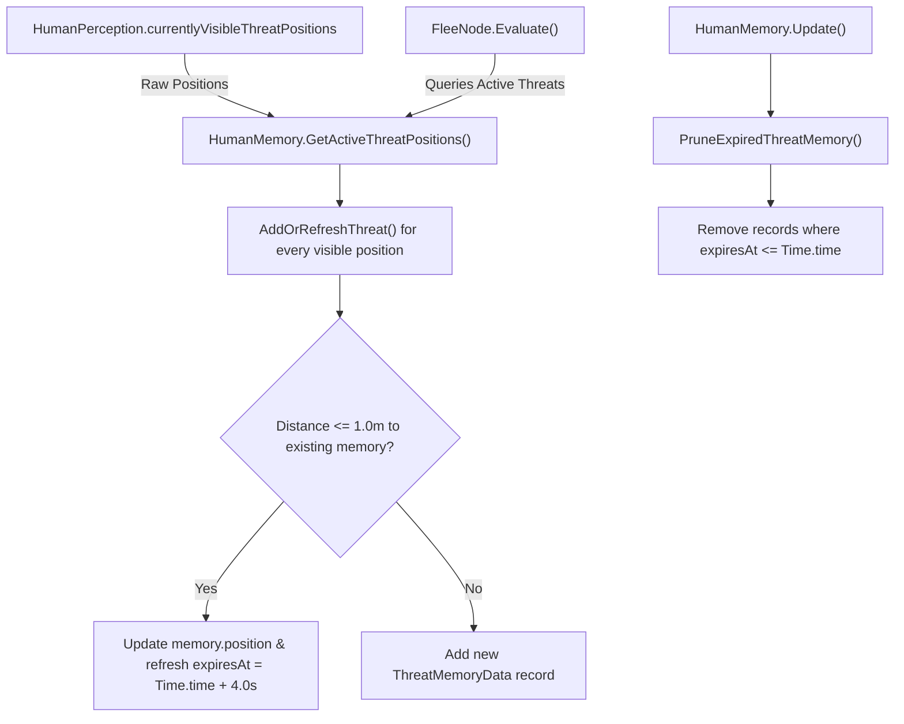

# Memory System

## Purpose
The Memory system allows agents to retain short-term spatial awareness of observed threats after they leave line of sight or sensory range, enabling continuous fleeing behavior and threat avoidance.

> [!NOTE]
> **Scope Limitation**: In the current implementation, `HumanMemory` exclusively stores **threat positions**. It does not retain records of discovered resources, tool locations, shelter coordinates, or other social agents.

---

## Responsibilities
* Store observed threat coordinates with associated expiration timestamps.
* Refresh bounded memory for every threat position supplied by legitimate perception.
* Merge spatially proximate threat observations to prevent duplicate memory accumulation.
* Prune expired threat records on every frame update.
* Provide an aggregated list of active and remembered threat positions to navigation systems ([`FleeNode`](file:///c:/UnityProjects/LifeEngine/Assets/Scripts/Humans/Behaviors/HumanBehaviors.cs)).

---

## Non-Responsibilities
* Does **not** store non-threat environmental knowledge (food bushes, trees, tools, crafting sites).
* Does **not** persist agent knowledge across scene changes or simulation restarts.
* Does **not** keep an untimed fallback threat active after its timestamped memory has expired.

---

## Main Files
* [`Assets/Scripts/Humans/HumanMemory.cs`](file:///c:/UnityProjects/LifeEngine/Assets/Scripts/Humans/HumanMemory.cs): Memory manager and spatial threat aggregator.

---

## State / Data
* **`defaultThreatMemoryDuration = 4.0f`**: Number of real-time seconds a remembered threat position persists after its most recent direct observation.
* **`ThreatMemoryData` (Struct)**:
  * `Vector3 position`: World position of the threat observation.
  * `float expiresAt`: Timestamp (`Time.time + duration`) when memory expires.
* **Internal Collections**:
  * `recentThreatPositions`: List of active memory structs (capacity 24).
  * `activeThreatPositions`: Preallocated list of unique threat vectors (capacity 32) returned to callers.
* **Cached References**:
  * `primaryThreat`: Transform of the immediate active threat.
  * `lastKnownThreatPosition`: Last world position recorded for the primary threat. This remains informational state and does not bypass bounded-memory expiry.

---

## Execution Flow

### Threat Merging & Deduplication
1. **Adding / Refreshing (`AddOrRefreshThreat`)**: When a threat point is added, the system checks existing memories. If candidate position is within $1.0\text{m}^2$ (`(pos - candidate).sqrMagnitude <= 1.0f`), the existing memory's position is updated and its expiration timer is extended to `Time.time + 4.0s`.
2. **Perception Handoff (`GetActiveThreatPositions`)**: Every currently visible threat supplied by perception is added to or refreshes timestamped memory before aggregation. This preserves multi-threat observations across the `CheckDangerNode` → `FleeNode` handoff.
3. **Aggregated Query (`GetActiveThreatPositions`)**: Combines currently visible threat positions with active, unexpired remembered positions, filtering out duplicate coordinates within $0.25\text{m}^2$ (`duplicateDistanceSqr = 0.25f`). A query with no currently visible threats returns only unexpired remembered records.

---

## Public API / Important Methods

* `AddOrRefreshThreat(Vector3 threatPosition)`: Adds a threat position or refreshes an existing proximate memory record.
* `SetPrimaryThreat(Transform threatTransform)`: Sets current primary threat transform, updates `lastKnownThreatPosition`, and refreshes bounded memory for that primary threat.
* `GetPrimaryThreat()`: Returns current primary threat transform (or null).
* `GetLastKnownThreatPosition()`: Returns last observed primary-threat coordinate for informational/debugging use.
* `GetActiveThreatPositions(List<Vector3> currentlyVisibleThreats)`: Refreshes memory for supplied visible threats, then returns the aggregated, deduplicated set of visible and unexpired remembered threat positions.

---

## Important Invariants
* **Perception-derived memory**: Threat memory is refreshed only from positions supplied by legitimate perception or the current primary threat; it does not discover threats globally.
* **Multi-threat preservation**: Every currently visible threat survives the perception-to-memory handoff for the configured bounded-memory duration, not only the nearest/primary threat.
* **Spatial Merging**: Observations within $1.0\text{m}$ are collapsed into a single memory to prevent linear memory bloat during continuous observation.
* **Bounded lifetime**: Flee-relevant remembered positions are sourced only from unexpired timestamped records; `lastKnownThreatPosition` cannot resurrect an expired threat.
* **Continuous Pruning**: Expired records (`expiresAt <= Time.time`) are automatically removed in `HumanMemory.Update()`.

---

## Configuration / Tunables
* `defaultThreatMemoryDuration`: $4.0\text{ s}$.
* Merge radius: $1.0\text{ m}$ ($1.0\text{ m}^2$ squared magnitude).
* Deduplication radius: $0.5\text{ m}$ ($0.25\text{ m}^2$ squared magnitude).

---

## Known Limitations
* **Single Domain Memory**: Only threats are remembered. When an agent spots a tool or food source but is interrupted, the agent completely forgets the location and must re-scan from scratch.

---

## Debugging
* Monitor `PanicTimer` in [`CheckDangerNode`](file:///c:/UnityProjects/LifeEngine/Assets/Scripts/Humans/Behaviors/HumanBehaviors.cs) via the `BehaviorTreeDebugger` window (`"Panic Timer: 2.3s"`).
