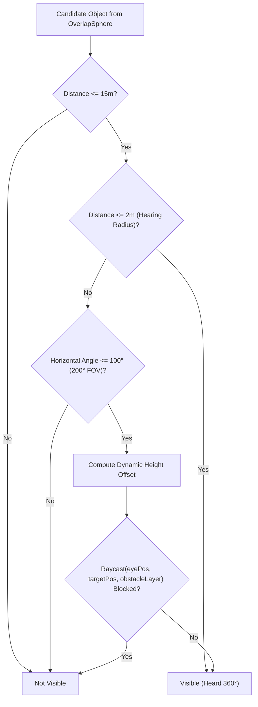

# Perception System

## Purpose
The Perception system provides simulated sensory capabilities—visual field of view, line-of-sight obstruction checks, omnidirectional hearing, and thermal scanning—allowing agents to detect threats, food, resources, and heat sources in their local environment.

---

## Responsibilities
* Scan nearby physics layers for threats, food items, natural resources, and heat sources.
* Filter candidates using visual range, horizontal field of view ($200^\circ$), omnidirectional hearing ($2.0\text{m}$), and obstruction raycasts.
* Adjust line-of-sight raycast target heights based on entity type (ground items vs. trees vs. humanoids).
* Provide throttle-controlled scan intervals to minimize CPU overhead.

---

## Non-Responsibilities
* Does **not** store or merge historical observations over time (delegated to [`HumanMemory`](file:///c:/UnityProjects/LifeEngine/Assets/Scripts/Humans/HumanMemory.cs)).
* Does **not** make decisions on how to react to perceived objects (delegated to the Behavior Tree).

---

## Main Files
* [`Assets/Scripts/Humans/HumanPerception.cs`](file:///c:/UnityProjects/LifeEngine/Assets/Scripts/Humans/HumanPerception.cs): Main sensory perception component.

---

## State / Data
* **Ranges & Angles**:
  * `dangerDetectionRadius = 15.0f` m (primary visual search radius).
  * `viewAngle = 200.0f` degrees (horizontal visual cone).
  * `hearingRadius = 2.0f` m ($360^\circ$ omnidirectional hearing range).
* **Scan Intervals**:
  * `dangerScanInterval = 0.2f` s (scan rate for threats and food).
* **Layer Masks**:
  * `obstacleLayer`: Layer mask for line-of-sight occlusion (defaults to `Layer 6 (Walls)`).
  * `threatLayer`: Overlap mask for hostile agents/creatures.
  * `foodLayer`: Overlap mask for edible items (`Layer 8 (Food)`).
  * `resourceLayer`: Overlap mask for dropped ground items (`Layer 10 (Resources)`).
  * `treeLayer`: Overlap mask for harvestable bushes/trees (`Layer 9 (Trees)`).
  * `heatSourceLayer`: Layer mask for thermal sources.
* **Cached Observables**:
  * `currentlyVisibleThreatPositions`: Raw list of currently observed threat positions (synchronized with `HumanMemory`).
  * `primaryThreat`: Closest visible threat transform.
  * `primaryFood`: Closest visible food transform.

---

## Sensory Pipeline (`CanSeeTarget`)

When scanning for an object, [`HumanPerception`](file:///c:/UnityProjects/LifeEngine/Assets/Scripts/Humans/HumanPerception.cs) evaluates visibility:

### Dynamic Target Height Offsets
Line-of-sight raycasts originate from the agent's eye level ($+1.5\text{m}$ Y) and target a dynamic vertical offset on the subject:
* **Ground Resource Items** ([`ResourceItem`](file:///c:/UnityProjects/LifeEngine/Assets/Scripts/World/ResourceItem.cs)): $+0.15\text{m}$ Y (targets item base).
* **Fellable Trees / Bushes** ([`FellableTree`](file:///c:/UnityProjects/LifeEngine/Assets/Scripts/World/FellableTree.cs)): $+0.60\text{m}$ Y (targets lower trunk).
* **Default / Humanoids**: $+0.80\text{m}$ Y (targets torso).

---

## Scan Methods & Execution Flow

### 1. Threat Scan (`PerformDangerScan`)
* Executed every `dangerScanInterval` ($0.2\text{s}$).
* Collects all colliders on `threatLayer` within $15\text{m}$.
* Populates `currentlyVisibleThreatPositions` and caches `primaryThreat`.

### 2. Resource Scan (`PerformResourceScan`)
* **Two-Tier Priority Scan**:
  1. **Ground Items First**: Scans `resourceLayer` for dropped [`ResourceItem`](file:///c:/UnityProjects/LifeEngine/Assets/Scripts/World/ResourceItem.cs) of matching `ResourceType`. If found, returns immediately to avoid unnecessary tree felling.
  2. **Living Source Second**: If no ground items are visible, scans `treeLayer` for [`FellableTree`](file:///c:/UnityProjects/LifeEngine/Assets/Scripts/World/FellableTree.cs) objects that yield the required resource and checks tool requirements (`Basic_Axe`).

### 3. Food Scan (`PerformFoodScan`)
* Scans `foodLayer` within $15\text{m}$ and caches `primaryFood`.

### 4. Heat Source Scan (`PerformHeatSourceScan`)
* Queries the static [`HeatSource.ActiveSources`](file:///c:/UnityProjects/LifeEngine/Assets/Scripts/World/HeatSource.cs) registry for active heat sources within $15\text{m}$.

---

## Public API / Important Methods

* `PerformDangerScan(out Transform closestThreat)`: Scans for threats, returns true if any threat is visible, and outputs the closest.
* `PerformResourceScan(ResourceType type, out Transform closestResource)`: Scans ground items first, then fellable sources for matching resource type.
* `PerformFoodScan(out Transform closestFood)`: Scans for food items on food layer.
* `PerformHeatSourceScan(out List<HeatSource> sources)`: Queries active heat sources in detection radius.

---

## Important Invariants
* **Hearing Bypass**: Targets within `hearingRadius` ($2.0\text{m}$) bypass the $200^\circ$ FOV angle check, modeling $360^\circ$ auditory awareness.
* **Ground Item Preference**: Resource scanning strictly prefers dropped items before living natural sources.

---

## Configuration / Tunables
* `dangerDetectionRadius`: $15.0\text{ m}$.
* `viewAngle`: $200.0^\circ$.
* `hearingRadius`: $2.0\text{ m}$.
* `dangerScanInterval`: $0.2\text{ s}$.

---

## Known Limitations
* **Bypassed in Global Searches**: Behavior nodes like `FindHarvestableSourceNode`, `FindToolOnGroundNode`, and `FindShadeSpotNode` perform global `Object.FindObjectsByType` searches rather than using `HumanPerception`.

---

## Debugging
Select an agent in the Editor Hierarchy to render perception gizmos:
* **Green / Red FOV Rays**: $200^\circ$ vision cone ($15\text{m}$ length). Turns red when `primaryThreat != null`.
* **Cyan Wire Sphere**: $2.0\text{m}$ hearing sphere.
