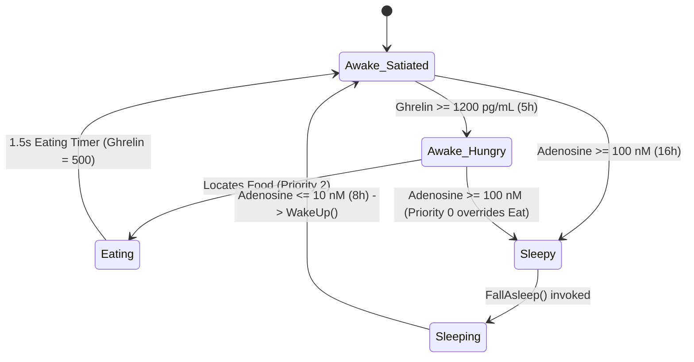

# Physiology & Metabolic Drives System

## Purpose
The Physiology system models internal biological drives—specifically sleep pressure (**Adenosine**) and hunger (**Ghrelin**)—to produce realistic survival motivations and cyclical agent behavior.

---

## Responsibilities
* Accumulate adenosine and ghrelin concentrations as game time advances while awake.
* Clear adenosine during active sleep and reset ghrelin upon food consumption.
* Manage physical state transitions for sleeping (disabling locomotion, making rigidbody kinematic, rotating model) and waking.

---

## Non-Responsibilities
* Does **not** perform pathfinding to beds, shelter, or food items (delegated to behavior tree and perception).
* Does **not** simulate complex nutrition, macronutrients, or digestive rates beyond discrete ghrelin reset.

---

## Main Files
* [`Assets/Scripts/Humans/HumanBrain.cs`](file:///c:/UnityProjects/LifeEngine/Assets/Scripts/Humans/HumanBrain.cs): State owner and lifecycle manager (`FallAsleep()`, `WakeUp()`, update loop accumulation).
* [`Assets/Scripts/Humans/Behaviors/HumanBehaviors.cs`](file:///c:/UnityProjects/LifeEngine/Assets/Scripts/Humans/Behaviors/HumanBehaviors.cs): Action nodes (`NeedsSleepNode`, `SleepNode`, `NeedsFoodNode`, `SeesFoodNode`, `EatFoodNode`).
* [`Assets/Scripts/Humans/HumanAnimationDriver.cs`](file:///c:/UnityProjects/LifeEngine/Assets/Scripts/Humans/HumanAnimationDriver.cs): Sends `isSleeping` boolean to Unity `Animator`.

---

## State / Data

### Adenosine (Sleep Pressure)
* **Variable**: `adenosineConcentration` (Units: nanomolar, $\text{nM}$).
* **Starting / Default**: `10.0 nM`.
* **Buildup Rate**: `adenosineBuildupPerHour = 5.625 nM / hour` (accumulates while awake).
* **Clearance Rate**: `adenosineClearancePerHour = 11.25 nM / hour` (clears while sleeping).
* **Sleep Threshold**: `100.0 nM` (triggers `NeedsSleepNode`).
* **Wake Threshold**: `10.0 nM` (triggers wake-up in `SleepNode`).

### Ghrelin (Hunger Drive)
* **Variable**: `ghrelinConcentration` (Units: picograms per milliliter, $\text{pg/mL}$).
* **Starting / Satiated**: `500.0 pg/mL`.
* **Buildup Rate**: `ghrelinBuildupPerHour = 140.0 pg/mL / hour` (accumulates while awake).
* **Hunger Threshold**: `ghrelinHungerThreshold = 1200.0 pg/mL` (triggers `NeedsFoodNode`).
* **Post-Eating Value**: Resets to `500.0 pg/mL`.

---

## Execution Flow

### Sleep Lifecycle
1. **Trigger**: When `adenosineConcentration >= 100f`, [`NeedsSleepNode`](file:///c:/UnityProjects/LifeEngine/Assets/Scripts/Humans/Behaviors/HumanBehaviors.cs) succeeds (Priority 0 in behavior tree).
2. **Sleep Onset (`HumanBrain.FallAsleep()`)**:
   * Sets `isSleeping = true`.
   * Disables `HumanLocomotion` and `NavMeshAgent`.
   * Sets `Rigidbody.isKinematic = true`.
   * Offsets position $-0.5\text{m}$ along Y and rotates $-90^\circ$ along X.
3. **Sleep Process (`SleepNode`)**:
   * Decreases `adenosineConcentration` by `adenosineClearancePerHour * gameHours`.
   * When `adenosineConcentration <= 10f`, invokes `WakeUp()` and returns `NodeState.Success`.
4. **Waking (`HumanBrain.WakeUp()`)**:
   * Sets `isSleeping = false`.
   * Restores `Rigidbody.isKinematic = false`, enables `NavMeshAgent` and `HumanLocomotion`.
   * Repositions $+0.5\text{m}$ on Y and resets rotation to upright ($0^\circ$ pitch/roll).

### Hunger Lifecycle
1. **Trigger**: When `ghrelinConcentration >= 1200f`, [`NeedsFoodNode`](file:///c:/UnityProjects/LifeEngine/Assets/Scripts/Humans/Behaviors/HumanBehaviors.cs) succeeds (Priority 2).
2. **Perception**: [`SeesFoodNode`](file:///c:/UnityProjects/LifeEngine/Assets/Scripts/Humans/Behaviors/HumanBehaviors.cs) scans for items on `Food` layer (`Layer 8`).
3. **Execution ([`EatFoodNode`](file:///c:/UnityProjects/LifeEngine/Assets/Scripts/Humans/Behaviors/HumanBehaviors.cs))**:
   * Agent runs toward food target.
   * When within $1.0\text{m}$, food object is destroyed and $1.5\text{s}$ eating timer starts.
   * On timer expiry, `ghrelinConcentration` is reset to `500f`.

---

## Public API / Important Methods
* `HumanBrain.FallAsleep()`: Switches agent to sleeping state, halts movement, and adjusts physics/transforms.
* `HumanBrain.WakeUp()`: Restores agent locomotion, physics, and standing posture.

---

## Important Invariants
* **Brain Ownership**: `HumanBrain` is the sole owner of metabolic concentrations and the `isSleeping` flag.
* **Component Safety**: Physics constraints, kinematic states, and NavMesh components are strictly toggled in sync during `FallAsleep()` / `WakeUp()` to prevent falling through terrain or phantom navigation updates.

---

## Configuration / Tunables
* `adenosineBuildupPerHour`: Buildup rate awake ($5.625\text{ nM/h}$).
* `adenosineClearancePerHour`: Clearance rate asleep ($11.25\text{ nM/h}$).
* `ghrelinBuildupPerHour`: Accumulation rate awake ($140.0\text{ pg/mL/h}$).
* `ghrelinHungerThreshold`: Food-seeking threshold ($1200.0\text{ pg/mL}$).

---

## Known Limitations
* **Binary Sleep Threshold**: Agents transition from normal operation directly into sleep with no gradual fatigue penalties on movement speed or sensory perception.
* **Instant Satiation**: Eating resets ghrelin instantly upon timer completion rather than simulating gradual nutrient absorption.

---

## Debugging
* Inspect live concentration values directly on the `HumanBrain` component in the Unity Inspector.
* The `BehaviorTreeDebugger` window displays formatted strings: `"Adenosine: 45.2nm"` and `"Ghrelin: 1250 pg/mL"`.
