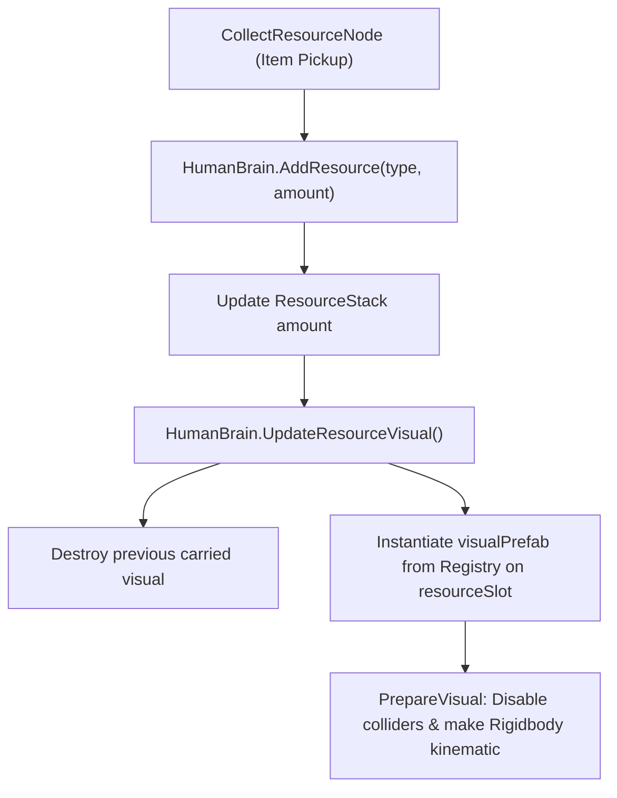

# Resources & Inventory System

## Purpose
The Resources and Inventory system defines discrete physical world materials, agent carrying capacities, tool ownership, and ScriptableObject registry mappings for visual and physical prefabs.

---

## Responsibilities
* Define discrete resource types ([`ResourceType`](file:///c:/UnityProjects/LifeEngine/Assets/Scripts/World/ResourceType.cs)) and tool items ([`ToolItem`](file:///c:/UnityProjects/LifeEngine/Assets/Scripts/World/ToolItem.cs)).
* Maintain carried inventory stacks ([`ResourceStack`](file:///c:/UnityProjects/LifeEngine/Assets/Scripts/Humans/HumanBrain.cs)) and tool lists on [`HumanBrain`](file:///c:/UnityProjects/LifeEngine/Assets/Scripts/Humans/HumanBrain.cs).
* Instantiate and update carried visual models in the agent's hand attachment slots (`toolSlot`, `resourceSlot`).
* Protect physical world resource drops from falling through terrain.

---

## Non-Responsibilities
* Does **not** compute construction requirements or recipe satisfaction (delegated to [`CraftingBlueprint`](file:///c:/UnityProjects/LifeEngine/Assets/Scripts/Crafting/CraftingBlueprint.cs)).

---

## Main Files
* [`Assets/Scripts/World/ResourceType.cs`](file:///c:/UnityProjects/LifeEngine/Assets/Scripts/World/ResourceType.cs): Enum defining all materials.
* [`Assets/Scripts/World/ResourceRegistry.cs`](file:///c:/UnityProjects/LifeEngine/Assets/Scripts/World/ResourceRegistry.cs): ScriptableObject mapping resource types to hand and world prefabs, tools, and recipes.
* [`Assets/Scripts/World/ResourceItem.cs`](file:///c:/UnityProjects/LifeEngine/Assets/Scripts/World/ResourceItem.cs): Physical world drop item component with floor recovery.
* [`Assets/Scripts/World/ToolItem.cs`](file:///c:/UnityProjects/LifeEngine/Assets/Scripts/World/ToolItem.cs): Component attached to permanent tools (e.g., `"Basic_Axe"`).
* [`Assets/Scripts/Humans/HumanBrain.cs`](file:///c:/UnityProjects/LifeEngine/Assets/Scripts/Humans/HumanBrain.cs): Inventory state owner and visual slot controller.

---

## State / Data

### Resource Types ([`ResourceType.cs`](file:///c:/UnityProjects/LifeEngine/Assets/Scripts/World/ResourceType.cs))
* `None = 0`
* `Log_1`, `Log_2`, `Log_3`, `Log_4` (Various log size classes)
* `Stick_1`, `Stick_2`, `Stick_3`, `Stick_4` (Various stick size classes)
* `Stone`, `Sharpened_Stone`

### Inventory Representation ([`HumanBrain.cs`](file:///c:/UnityProjects/LifeEngine/Assets/Scripts/Humans/HumanBrain.cs))
* **Resource Inventory**: `List<ResourceStack> inventory`
  * Each `ResourceStack` contains `ResourceType type` and `int amount`.
* **Tool Inventory**: `List<string> toolInventory` (List of acquired tool names, e.g., `"Basic_Axe"`).
* **Hand Attachment Slots**:
  * `Transform resourceSlot`: Right/carrying hand socket.
  * `Transform toolSlot`: Primary tool hand socket.

### Resource Registry ([`ResourceRegistry.cs`](file:///c:/UnityProjects/LifeEngine/Assets/Scripts/World/ResourceRegistry.cs))
* `resources`: List of `ResourceMapping` (`type`, `visualPrefab`, `worldPrefab`).
* `tools`: List of `ToolMapping` (`toolName`, `visualPrefab`).
* `recipes`: List of `Recipe` (`name`, `input`, `inputQuantity`, `outputs`, `duration`).

---

## Execution Flow & Visual Handlers

### 1. Hand Visual Preparation (`PrepareVisual`)
When visual prefabs are instantiated on `resourceSlot` or `toolSlot`:
* All `Collider` components in children are disabled to prevent physical self-collision.
* All `Rigidbody` components are set to `isKinematic = true` and `useGravity = false`.

### 2. World Item Safety Recovery ([`ResourceItem.cs`](file:///c:/UnityProjects/LifeEngine/Assets/Scripts/World/ResourceItem.cs))
Physical drops on the terrain monitor their elevation. If physics solver tunneling causes an item to fall below $y < -10.0\text{m}$:
* Position is restored to $(x, 1.0\text{m}, z)$.
* Linear and angular velocity are zeroed to prevent repeat clipping.

---

## Public API / Important Methods

* `HumanBrain.AddResource(ResourceType type, int amount)`: Adds quantity to existing stack or appends new `ResourceStack`, then refreshes hand visual.
* `HumanBrain.RemoveResource(ResourceType type, int amount)`: Deducts quantity, removes stack if depleted, and refreshes hand visual.
* `HumanBrain.GetResourceCount(ResourceType type)`: Returns total carried units of specified type.
* `HumanBrain.HasCarriedResource()`: Returns true if `inventory.Count > 0`.
* `HumanBrain.HasTool(string toolName)`: Returns true if `toolInventory.Contains(toolName)`.
* `ResourceRegistry.GetResourcePrefab(ResourceType type)`: Returns hand visual prefab.
* `ResourceRegistry.GetWorldPrefab(ResourceType type)`: Returns physical world drop prefab.
* `ResourceRegistry.GetToolPrefab(string toolName)`: Returns tool hand visual prefab.

---

## Important Invariants
* **Non-Destructive Inventory Deductions**: `RemoveResource` must only be called with the exact accepted count returned by downstream receivers (such as [`CraftingBlueprint`](file:///c:/UnityProjects/LifeEngine/Assets/Scripts/Crafting/CraftingBlueprint.cs)).
* **Kinematic Visuals**: Carried visual models attached to agent bone slots must remain kinematic and non-colliding.

---

## Configuration / Tunables
* Configured in `Assets/ResourceRegistry.asset` in the Unity Editor.

---

## Known Limitations
* **Unbounded Capacity**: Inventory lists currently enforce no weight, slot count, or volume limits.
* **Single Active Tool Hardcoding**: `HumanBrain.UpdateToolVisual()` currently checks explicitly for `"Basic_Axe"`.

---

## Debugging
* View the `Inventory` and `Tool Inventory` lists directly on `HumanBrain` in the Unity Inspector.
