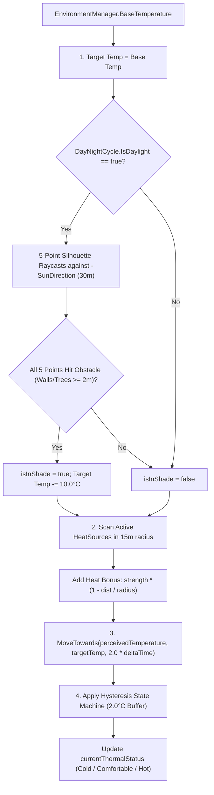

# Thermal Comfort System

## Purpose
The Thermal Comfort system models ambient world temperature, solar exposure (shade), and local heat radiation, driving agents to seek shade when overheating or gather by heat sources and build campfires when freezing.

---

## Responsibilities
* Compute authoritative perceived body temperature and assign `ThermalStatus` (`Cold`, `Comfortable`, `Hot`) on [`HumanBrain`](file:///c:/UnityProjects/LifeEngine/Assets/Scripts/Humans/HumanBrain.cs).
* Perform 5-point silhouette raycasting to detect whether the agent is fully shaded from direct sunlight.
* Aggregate distance-attenuated thermal bonuses from active [`HeatSource`](file:///c:/UnityProjects/LifeEngine/Assets/Scripts/World/HeatSource.cs) instances.
* Apply temperature smoothing and deadband hysteresis to prevent state oscillation.
* Drive thermal behavior goals in the Behavior Tree (seeking shade, seeking existing fires, or initiating campfire construction).

---

## Non-Responsibilities
* Does **not** determine global diurnal temperature curves (owned by [`EnvironmentManager`](file:///c:/UnityProjects/LifeEngine/Assets/Scripts/World/EnvironmentManager.cs)).
* Does **not** control celestial lighting or sun angles (owned by [`DayNightCycle`](file:///c:/UnityProjects/LifeEngine/Assets/Scripts/World/DayNightCycle.cs)).

---

## Main Files
* [`Assets/Scripts/Humans/HumanBrain.cs`](file:///c:/UnityProjects/LifeEngine/Assets/Scripts/Humans/HumanBrain.cs): State owner and thermal calculation pipeline (`UpdateThermalState()`).
* [`Assets/Scripts/Humans/Behaviors/HumanBehaviors.cs`](file:///c:/UnityProjects/LifeEngine/Assets/Scripts/Humans/Behaviors/HumanBehaviors.cs): Thermal behavior nodes (`NeedsWarmthNode`, `FindHeatSourceNode`, `MoveToHeatSourceNode`, `FindShadeSpotNode`, `MoveToShadeNode`).
* [`Assets/Scripts/World/HeatSource.cs`](file:///c:/UnityProjects/LifeEngine/Assets/Scripts/World/HeatSource.cs): Radial heat emitter component with static registry.
* [`Assets/Scripts/World/EnvironmentManager.cs`](file:///c:/UnityProjects/LifeEngine/Assets/Scripts/World/EnvironmentManager.cs): World base temperature curve provider.
* [`Assets/Scripts/World/DayNightCycle.cs`](file:///c:/UnityProjects/LifeEngine/Assets/Scripts/World/DayNightCycle.cs): Sun direction provider.

---

## State / Data
* **`comfortRangeMin = 18.0f`**: Minimum comfortable temperature ($^\circ\text{C}$).
* **`comfortRangeMax = 26.0f`**: Maximum comfortable temperature ($^\circ\text{C}$).
* **`perceivedTemperature`**: Current smoothed agent temperature (defaults to $22.0^\circ\text{C}$).
* **`currentThermalStatus`**: Authoritative enum (`Cold`, `Comfortable`, `Hot`).
* **`isInShade`**: Boolean indicating full 5-point silhouette occlusion.
* **`shadeMask`**: Layer mask `(1 << 0) | (1 << 6) | (1 << 9)` (`Default | Walls | Trees`).

---

## Thermal Calculation Pipeline

In every frame update, `HumanBrain.UpdateThermalState()` calculates:

### 1. 5-Point Silhouette Shade Raycasting
To verify that the entire body is shaded from direct sunlight:
* Head: $\text{pos} + (0, 1.8\text{m}, 0)$
* Center: $\text{pos} + (0, 1.0\text{m}, 0)$
* Right Shoulder: $\text{pos} + (0, 1.5\text{m}, 0) + \text{transform.right} \cdot 0.4\text{m}$
* Left Shoulder: $\text{pos} + (0, 1.5\text{m}, 0) - \text{transform.right} \cdot 0.4\text{m}$
* Feet: $\text{pos} + (0, 0.2\text{m}, 0)$
Each ray fires along $-\vec{d}_{\text{sun}}$ for $30\text{m}$. A point counts as shaded if it hits an obstacle on Layer 6 (Walls) or a collider with height $\ge 2.0\text{m}$. If all 5 points hit, full shade bonus ($-10^\circ\text{C}$) applies.

### 2. Heat Source Radial Attenuation
Active heat sources registered in `HeatSource.ActiveSources` add temperature based on distance:
$$\Delta T = \text{strength} \cdot \left(1 - \frac{\text{distance}}{\text{radius}}\right) \quad (\text{for distance} < \text{radius})$$

### 3. Hysteresis State Machine ($2.0^\circ\text{C}$ Deadband)
* If currently `Hot`: remains `Hot` until $T_{\text{perceived}} \le 24.0^\circ\text{C}$ ($26.0 - 2.0$).
* If currently `Cold`: remains `Cold` until $T_{\text{perceived}} \ge 20.0^\circ\text{C}$ ($18.0 + 2.0$).
* If currently `Comfortable`: transitions to `Hot` if $T > 26.0^\circ\text{C}$, or `Cold` if $T < 18.0^\circ\text{C}$.

---

## Behavior Tree Integration

Thermal goals execute under **Priority 4**:
* **Overheating (`ThermalStatus.Hot`)**:
  * `Seek Shade Branch`: `FindShadeSpotNode` locates nearest tree $> 2.0\text{m}$ tall; `MoveToShadeNode` positions agent $2.5\text{m}$ along the shadow vector until `isInShade == true`.
* **Freezing (`ThermalStatus.Cold`)**:
  * `Seek Warmth Branch`: [`NeedsWarmthNode`](file:///c:/UnityProjects/LifeEngine/Assets/Scripts/Humans/Behaviors/HumanBehaviors.cs) evaluates `currentThermalStatus == Cold`.
  * `Find or Build Fire`: Searches for existing heat sources via `FindHeatSourceNode` $\rightarrow$ `MoveToHeatSourceNode`. If none exist, falls back to `SetCraftingTargetNode(campfireBlueprintPrefab)` and executes the crafting subtree.

---

## Public API / Important Methods

* `HumanBrain.UpdateThermalState()`: Executes full thermal update pipeline and assigns status enum.
* `HeatSource.GetHeatBonusAt(Vector3 observerPosition)`: Returns heat bonus in Celsius at given coordinate.

---

## Important Invariants
* **Sole Authority**: `HumanBrain` is the only system permitted to evaluate temperature numbers and transition `currentThermalStatus`. Behavior nodes must strictly read the enum status.
* **Hysteresis Deadband**: The $2.0^\circ\text{C}$ buffer is mandatory to prevent flip-flop behavior oscillations when hovering near threshold boundaries.

---

## Configuration / Tunables
* `comfortRangeMin`: $18.0^\circ\text{C}$.
* `comfortRangeMax`: $26.0^\circ\text{C}$.
* Temperature smoothing rate: $2.0^\circ\text{C}/\text{s}$.
* Full shade temperature reduction: $-10.0^\circ\text{C}$.
* Campfire default: $\text{strength} = 25.0^\circ\text{C}$, $\text{radius} = 6.0\text{m}$.

---

## Known Limitations
* `FindShadeSpotNode` performs global searches via `Object.FindObjectsByType<FellableTree>()`.

---

## Debugging
* Monitor `perceivedTemperature` and `currentThermalStatus` in the `HumanBrain` inspector.
* In the `BehaviorTreeDebugger` window, `NeedsWarmthNode` displays: `"Perceived: 14.5°C [Cold]"`.
